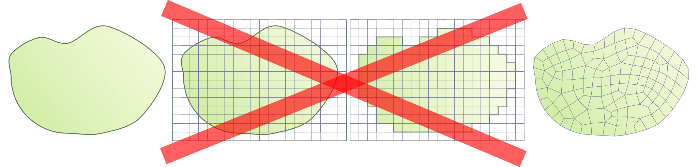
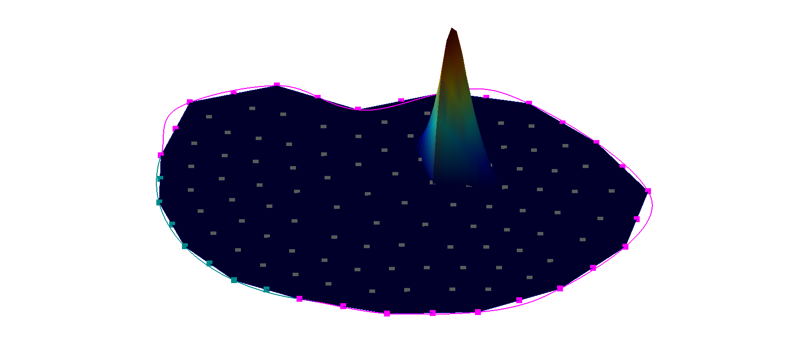
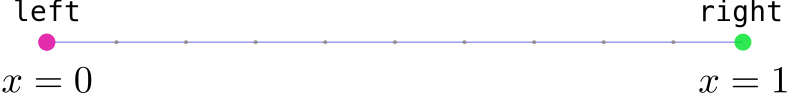
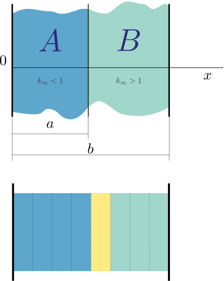
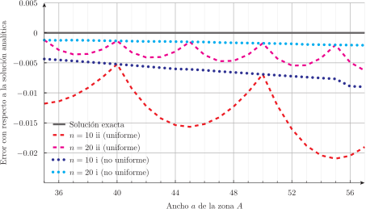

---
title: Transporte de neutrones en la nube
subtitle: Tesis de Doctorado en Ingeniería Nuclear
author: Mg. Ing. Germán Theler
institute: Instituto Balseiro
aspectratio: 169
lang: es-AR
theme: default
innertheme: rectangles
fonttheme: professionalfonts
outertheme: number
colorlinks: true
sansfont: Carlito
monofont: DejaVuSansMono
header-includes:
  - \usepackage{algorithm2e}
  - \newcommand{\omegaversor}{\hat{\symbf{\Omega}}}
  - \newcommand{\omegaprimaversor}{\hat{\symbf{\Omega}}^\prime}
  - \renewcommand{\vec}[1]{\mathbf{#1}}
  - \newcommand{\mat}[1]{\mathsf{#1}}
  - \renewcommand\spanishtablename{Tabla}
  - \input{syntax-feenox.tex}
  - \input{syntax.tex}
...

# Prolegómeno

## 

\centering 

## 

:::::::::::::: {.columns}
::: {.column width="37.5%"}

:::
::: {.column width="25%"}


\medskip


:::
::: {.column width="37.5%"}

:::
::::::::::::::

## 

\centering
{height=5.75cm}
{height=5.75cm}

## 

\centering 


## 

:::::::::::::: {.columns}
::: {.column width="50%"}
\centering 
:::
::: {.column width="50%"}
\centering 
:::
::::::::::::::


## 

\centering 

## 

\centering 

## 

\centering 


## 

\centering 


## 

```{=latex}
\begin{center}
\small{A cloud-first approach for solving core-level neutron transport over unstructured grids}
\end{center}
```

\medskip

. . .


$$
\underbrace{\text{Transporte de neutrones}}_\text{física de reactores}
\underbrace{\text{en la nube}}_\text{programación}
$$

. . .

\medskip


:::::::::::::: {.columns}
::: {.column width="22%"}
:::

::: {.column width="46%"}

\vspace{0.6cm}

 1. Introducción

\vspace{1.05cm}

 2. Transporte y difusión de neutrones
 3. Esquemas de discretización numérica

\vspace{0.95cm}

 4. Implementación computacional
 5. Resultados

:::

::: {.column width="10%"}

$$
\left.
\begin{matrix} ~ \end{matrix}
\right\} \text{Why}
$$

$$
\left.
\begin{matrix} ~ \\ ~ \end{matrix}
\right\} \text{How}
$$


$$
\left.
\begin{matrix} ~ \\ ~ \end{matrix}
\right\} \text{What}
$$

:::

::: {.column width="22%"}
:::

::::::::::::::


## 

\centering 


## Cien años de programación


 Computer | Monthly Rental  | Relative Speed | First Delivery 
:----------------|:------------------------:|:-----------:|:-----------:
 CDC 3800        |         $ 50,000         |     1       |  Jan 66
 CDC 6600        |         $ 80,000         |     6       |  Sep 64
 CDC 6800        |         $ 85,000         |     20      |  Jul 67
 GE 635          |         $ 55,000         |     1       |  Nov 64
 IBM 360/62      |         $ 58,000         |     1       |  Nov 65
 IBM 360/70      |         $ 80,000         |     2       |  Nov 65
 IBM 360/92      |         $ 142,000        |     20      |  Nov 66
 PHILCO 213      |         $ 78,000         |     2       |  Sep 65
 UNIVAC 1108     |         $ 45,000         |     2       |  Aug 65

: "Recent developments in computers and their implication for reactor calculations" (1965)^[1 USD @ 1965 $\approx$ 10 USD @ 2023]

## Historia de dos reactores


. . .


## Inyección rápida de boro: esquema de dos pasos


## Inyección rápida de boro: esquema acoplado con cinética espacial


## Inyección rápida de boro: esquema acoplado con cinética espacial


## Los canales de los PHWR

:::::::::::::: {.columns}
::: {.column width="45%"}


\centering Atucha

:::

::: {.column width="10%"}
:::

::: {.column width="45%"}


\centering CANDU

:::
::::::::::::::


## 

:::::::::::::: {.columns}
::: {.column width="45%"}

:::

::: {.column width="10%"}
. . . 
:::

::: {.column width="45%"}

:::
::::::::::::::

. . . 

:::::::::::::: {.columns}
::: {.column width="45%"}

:::

::: {.column width="10%"}
. . . 
:::

::: {.column width="45%"}

:::
::::::::::::::


## Celdas estructuradas...

:::::::::::::: {.columns}
::: {.column width="50%"}


\centering de representación
:::

::: {.column width="50%"}


\centering de cálculo
:::
::::::::::::::


## 

\centering 

## 

\centering 


## 

\centering 

## 

:::::::::::::: {.columns}
::: {.column width="50%"}

\centering 

\centering +

\centering {width=60%}

:::

. . .

::: {.column width="50%"}

\centering 

:::
::::::::::::::


## 

\centering 


. . . 


\centering ¿Vale usar difusión?

  

 
## Limitaciones


 i. dilución de XS por mismatch de mallas CFD/neutrónica
 
 ii. efecto staircase al modelar canales circulares
 
 iii. cuestionable validez de difusión
 
\bigskip 
 
. . .

### La propuesta de esta tesis


$$
\text{difusión} \rightarrow \text{muy simplificado} \Rightarrow S_N \rightarrow \text{escala muy rápido} \Rightarrow \text{esquema}
\begin{cases}
 \text{paralelizable} \\
 \text{flexible} \\
 \text{extensible}
\end{cases}
$$

. . .

$$
\text{paralelizable} \rightarrow \text{descomposición de dominio} \rightarrow \text{DAG} = \text{malla no estructurada}
$$


## IAEA 3D PWR Benchmark (1976)

:::::::::::::: {.columns}
::: {.column width="50%"}

:::

::: {.column width="50%"}

:::
::::::::::::::

## 

:::::::::::::: {.columns}
::: {.column width="56%"}

:::

::: {.column width="44%"}
\vspace{0.6cm}

:::
::::::::::::::


## 

:::::::::::::: {.columns}
::: {.column width="56%"}

:::

::: {.column width="44%"}
\vspace{0.6cm}

:::
::::::::::::::


## 

:::::::::::::: {.columns}
::: {.column width="56%"}

:::

::: {.column width="44%"}
\vspace{0.6cm}

:::
::::::::::::::

## IAEA 3D PWR Benchmark con 1/8, reflector circular & S$_4$ (2023)

:::::::::::::: {.columns}
::: {.column width="50%"}
\centering {height=8cm}
:::

::: {.column width="50%"}
\centering  {height=8cm}
:::
::::::::::::::


## 

\centering 


## 

:::::::::::::: {.columns}
::: {.column width="20%"}

\vspace{1cm}

\centering 

Lucio Séneca

4 a.C.---65 d.C.
:::

::: {.column width="80%"}

> No debemos tan sólo escribir ni tan sólo leer.
> Hay que acudir a la vez a lo uno y a lo otro, y combinar ambos ejercicios a fin de que, cuantos pensamientos ha recogido la lectura, los reduzca a la unidad.
>
> \medskip
>
> Lo que comprobamos que realiza en nuestro cuerpo la naturaleza sin ninguna colaboración nuestra, es eso lo que tenemos que hacer con la lectura. Los alimentos que tomamos, mientras mantienen su propia cualidad y compactos flotan en el estómago, son una carga.
> Mas cuando se ha producido su trasformación, entonces y sólo entonces, se convierten en fuerza y sangre.
> Procuremos otro tanto con los alimentos que nutren nuestro espíritu.
> No permitamos que queden intactos cuántos hayamos ingerido para que no resulten ajenos a nosotros.
> Asimilémoslos. De otra suerte, irán al acervo de la memoria y no al de la inteligencia.
>
> \medskip
>
> ¿Cómo lograr esto te preguntas? Con una constante aplicación.
>
>

:::
::::::::::::::

## 2. Transporte y difusión de neutrones

:::::::::::::: {.columns}
::: {.column width="50%"}

 1. Secciones eficaces
    1. Dispersión de neutrones
    2. Expansión en polinomios de Legendre
    3. Fisión de neutrones
 2. Flujos y ritmos de reacción
 3. Transporte de neutrones
    1. Operador de transporte
    2. Operador de desapariciones
    3. Operador de producciones
    4. La ecuación de transporte
    5. Armónicos esféricos y polinomios de Legendre
    6. Transporte linealmente anisótropo en estado estacionario
    7. Condiciones iniciales y de contorno
    
:::
::: {.column width="50%"}
    
    
 4. Aproximación de difusión
    1. Momento de orden cero
    2. Momento de orden uno
    3. Ley de Fick
    4. La ecuación de difusión
    5. Condiciones de contorno
 5. Esquema de solución multi-escala
    1. Evaluación y procesamiento de secciones eficaces
    2. Cálculo a nivel celda
    3. Cálculo a nivel núcleo
    
. . .

\medskip

\centering 


<https://github.com/gtheler/thesis>

. . .


:::
::::::::::::::

## Ecuación de transporte

$$
\begin{gathered}
 \sqrt{\frac{m}{2E}} \frac{\partial}{\partial t} \Big[ \psi(\vec{x}, \omegaversor, E, t) \Big]
 + \omegaversor \cdot \text{grad} \left[ \psi(\vec{x}, \omegaversor, E, t) \right]
 + \Sigma_t(\vec{x}, E) \cdot \psi(\vec{x}, \omegaversor, E, t) = \\
 \int_{0}^{\infty} \int_{4\pi} \Sigma_s(\vec{x}, \omegaprimaversor \rightarrow \omegaversor, E^\prime \rightarrow E) \cdot \psi(\vec{x}, \omegaprimaversor, E^\prime, t) \, d\omegaprimaversor \, dE^\prime \\
+ \frac{\chi(E)}{4\pi} \int_{0}^{\infty} \int_{4\pi} \nu\Sigma_f(\vec{x}, E^\prime) \cdot \psi(\vec{x}, \omegaprimaversor, E^\prime, t) \, d\omegaprimaversor \, dE^\prime 
+ s(\vec{x}, \omegaversor, E, t)
\end{gathered}
$$

## Expansión en Legendre y armónicos esféricos

:::::::::::::: {.columns}
::: {.column width="42.5%"}

\vspace{1cm}

\centering 
    
:::
::: {.column width="57.5%"}
\centering 
:::
::::::::::::::


## Transporte linealmente anisótropo en estado estacionario

$$
\begin{gathered}
 \omegaversor \cdot \text{grad} \left[ \psi(\vec{x}, \omegaversor, E) \right]
 + \Sigma_t(\vec{x}, E) \cdot \psi(\vec{x}, \omegaversor, E) = \\
\frac{1}{4\pi} \cdot 
\int_{0}^{\infty} \Sigma_{s_0}(\vec{x}, E^{\prime} \rightarrow E) \cdot \int_{4\pi} \psi(\vec{x}, \omegaprimaversor, E^{\prime}) \, d\omegaprimaversor \, dE^\prime + \\
\frac{3 \cdot \omegaversor}{4\pi} \cdot
\int_{0}^{\infty} \Sigma_{s_1}(\vec{x}, E^{\prime} \rightarrow E) \cdot \int_{4\pi} \psi(\vec{x}, \omegaprimaversor, E^{\prime}) \cdot \omegaprimaversor \, d\omegaprimaversor \, dE^\prime  \\
+ \frac{\chi(E)}{4\pi} \int_{0}^{\infty} \nu\Sigma_f(\vec{x}, E^\prime) \cdot \phi(\vec{x}, E^\prime) \, dE^\prime 
+ s(\vec{x}, \omegaversor, E)
\end{gathered}
$$


## Aproximación de difusión

 i.
    
    a. el problema sea estacionario, o    
    b. que $\frac{3}{v}  \frac{\partial \vec{J}}{\partial t} \ll \text{grad} \left[ \phi(\vec{x}, E,t ) \right]$

\medskip
    
 ii.
 
     a. no haya fuentes independientes, o
     b. que la fuente independiente sea isótropa

\medskip
          
     
 iii.
 
      a. el scattering sea isótropo (en el marco de referencia del reactor), o
      b. que $\int_0^\infty \Sigma_{s_1}(\vec{x}, E^\prime \rightarrow E) \cdot \vec{J}(\vec{x}, E^\prime, t) \, dE^\prime \simeq \int_0^\infty \Sigma_{s_1}(\vec{x}, E \rightarrow E^\prime) \cdot \vec{J}(\vec{x}, E, t) \, dE^\prime$


$$
\begin{gathered}
 - \text{div} \Big[ D(\vec{x}, E) \cdot \text{grad} \left[ \phi(\vec{x}, E) \right] \Big]
 + \Sigma_t(\vec{x}, E) \cdot \phi(\vec{x}, E)
 = \\
\int_{0}^{\infty} \Sigma_{s_0}(\vec{x}, E^{\prime} \rightarrow E)  \cdot \phi(\vec{x}, E^\prime) \, dE^\prime +
\chi(E) \int_{0}^{\infty} \nu\Sigma_f(\vec{x}, E^\prime) \cdot \phi(\vec{x}, E^\prime) \, dE^\prime
+ s_0(\vec{x}, E)
\end{gathered}
$$


## 3. Esquemas de discretización numérica


:::::::::::::: {.columns}
::: {.column width="25%"}

\vspace{1cm}

\centering 

Paul Graham

1964--
:::

::: {.column width="75%"}

\vspace{1cm}

> You can know a great deal about something without writing about it. Can you ever know so much that you wouldn't learn more from trying to explain what you know? I don't think so. I've written about at least two subjects I know well---Lisp hacking and startups---and in both cases I learned a lot from writing about them.^[Machinery and circuits are formal languages.] In both cases there were things I didn't consciously realize till I had to explain them. And I don't think my experience was anomalous. A great deal of knowledge is unconscious, and experts have if anything a higher proportion of unconscious knowledge than beginners.
>

:::
::::::::::::::


## 3. Esquemas de discretización numérica

### Discretización en energía: multi-grupo

{width=100%}

. . .

### Discretización en ángulo: ordenadas discretas

:::::::::::::: {.columns}
::: {.column width="25%"}

:::
::: {.column width="25%"}

:::
::: {.column width="25%"}

:::
::: {.column width="20%"}

:::
::::::::::::::


## Discretización en espacio: elementos finitos

$$
\begin{cases}
-\text{div} \Big[ k(\vec{x}) \cdot \text{grad} \left[ u(\vec{x}) \right] \Big] = f(\vec{x}) & \forall\vec{x} \in U \\
u(\vec{x}) = 0 & \forall \vec{x} \in \Gamma_D \\
k(\vec{x}) \cdot \Big[ \text{grad} \left[ u(\vec{x}) \right] \cdot \hat{\vec{n}} \Big] = p(\vec{x}) & \forall \vec{x} \in \Gamma_N
\end{cases}
$$

. . .

$$
\int_U \text{grad} \left[ v(\vec{x}) \right] \cdot k(\vec{x}) \cdot \text{grad} \left[ u(\vec{x}) \right]  \,d^D\vec{x}
=
\int_U v(\vec{x}) \cdot f(\vec{x}) \,d^D\vec{x}
+ \int_{\Gamma_N} p(\vec{x}) \cdot v(\vec{x}) \,d^{D-1}\vec{x}
$$


$$
\text{encontrar~} u(\vec{x}) \in V: \quad
\mathcal{a} \Big(u(\vec{x}), v(\vec{x})\Big) = \mathcal{B} \Big(v(\vec{x})\Big)
\quad  \forall v(\vec{x}) \in V
$$

$$
\begin{aligned}
\mathcal{a}(u,v) &= \int_U \text{grad}\Big[ v(\vec{x}) \Big] \cdot k(\vec{x}) \cdot \text{grad}\Big[ u(\vec{x}) \Big] \, d^D \vec{x} \\
\mathcal{B}(v) &= \int_U v(\vec{x}) \cdot f(\vec{x}) \, d^D \vec{x} + \int_{\Gamma_N} v(\vec{x}) \cdot p(\vec{x}) \, d^{D-1} \vec{x}
\end{aligned}
$$

## Discretización en espacio: elementos finitos


## Discretización en espacio: elementos finitos


## Discretización en espacio: elementos finitos

:::::::::::::: {.columns}
::: {.column width="50%"}

:::
::: {.column width="50%"}

:::
::::::::::::::

:::::::::::::: {.columns}
::: {.column width="50%"}

:::
::: {.column width="50%"}

:::
::::::::::::::


## Discretización en espacio: elementos finitos


## Discretización en espacio: elementos finitos

$$
\mat{K} \cdot \vec{u} = \vec{b}
$$

$$
\mat{K}_i \approx
\sum_{q=1}^Q 
\underbrace{\omega_q \cdot \Big|\det{\left[\mat{J}_i\left(\symbf{\xi}_q\right)\right]}\Big|}_{\text{cuadratura numérica sobre $e_c$}}
\underbrace{\left\{ \mat{B}_i^T(\symbf{\xi}_q) \cdot k(\vec{x}_q) \cdot \mat{B}_i(\symbf{\xi}_q) \right\}}_{\text{discretización del operador $-\text{div}(k \cdot \nabla u)$}}
$$

$$
\vec{b}_i
\approx
\sum_{q=1}^Q
\underbrace{\omega_q \cdot \Big|\det{\left[\mat{J}_i\left(\symbf{\xi}_q\right)\right]}\Big|}_{\text{cuadratura numérica sobre $e_c$}}
\underbrace{\left\{\mat{H}_c^T(\symbf{\xi}_q) \cdot f(\vec{x}_q)\right\}}_{\text{discretización del miembro derecho $f$}}
$$

. . .

:::::::::::::: {.columns}
::: {.column width="65%"}

:::

. . .

::: {.column width="35%"}
$$
u(\vec{x}) = \sum_{j=1}^{35} h_j(\vec{x}) \cdot u_j 
$$
:::
::::::::::::::


## Extras

 a. Elementos de segundo orden

    :::::::::::::: {.columns}
    ::: {.column width="50%"}
    
    :::
    ::: {.column width="50%"}
    
    :::
    ::::::::::::::


. . . 


 b. Condiciones de Dirichlet no homogéneas

    * Prueba de que usar `MatZeroRows()` (o `MatZeroRowsColumns()`) es correcto (páginas 124--126)

      <https://scicomp.stackexchange.com/questions/5072/how-to-properly-apply-non-homogeneous-dirichlet-boundary-conditions-with-fem>

    * Segunda respuesta más votada (después de la de Jed Brown)


## Difusión de neutrones multigrupo en estado estacionario

$$ 
\begin{gathered}
 - \text{div} \Big[ D_g(\vec{x}) \cdot \text{grad} \left[ \phi_g(\vec{x}) \right] \Big]
 + \Sigma_{t g}(\vec{x}) \cdot \phi_g(\vec{x})
 = \\
\sum_{g^\prime = 1}^G \Sigma_{s_0 g^\prime \rightarrow g}(\vec{x})  \cdot \phi_{g^\prime}(\vec{x}) +
\chi_g \sum_{g^\prime = 1}^G \nu\Sigma_{fg^\prime}(\vec{x}) \cdot \phi_{g^\prime}(\vec{x})+ s_{0g}(\vec{x})
\end{gathered}
$$ 


$$
\begin{aligned}
\mat{K}_i &= 
\sum_{q=1}^Q \omega_q \cdot \Big|\det{\left[\mat{J}_i\left(\symbf{\xi}_q\right)\right]}\Big| \cdot \left[ \mat{L}_i(\symbf{\xi}_q) + \mat{A}_i(\symbf{\xi}_q) - \mat{F}_i(\symbf{\xi}_q)\right]
\end{aligned}
$$

\vspace{-0.5cm}

$$
\begin{aligned}
\mat{L}_i &= \mat{B}_{Gi}^T(\symbf{\xi}_q) \cdot \mat{D}_D(\symbf{\xi}_q) \cdot \mat{B}_{Gi}(\symbf{\xi}_q)  \\
\mat{A}_i &= \mat{H}_{Gc}^T(\symbf{\xi}_q) \cdot \mat{R}(\symbf{\xi}_q) \cdot \mat{H}_{Gc}(\symbf{\xi}_q) \\
\mat{F}_i &= \mat{H}_{Gc}^T(\symbf{\xi}_q) \cdot \mat{X}(\symbf{\xi}_q) \cdot \mat{H}_{Gc}(\symbf{\xi}_q)
\end{aligned}
$$

$$
\begin{aligned}
\vec{b}_i &= 
\sum_{q=1}^Q \omega_q \cdot \Big|\det{\left[\mat{J}_i\left(\symbf{\xi}_q\right)\right]}\Big| \cdot \left[  \mat{H}_c^T(\symbf{\xi}_q) \cdot \vec{s}(\vec{x}_q)   \right]
\end{aligned}
$$

## Ordenadas discretas en estado estacionario

$$
\begin{gathered}
\omegaversor_m \cdot \text{grad} \left[ \psi_{mg}(\vec{x}) \right]  +
\Sigma_{t g}(\vec{x}) \cdot \psi_{mg}(\vec{x}) = s_{mg}(\vec{x}) +
\sum_{g^\prime=1}^G \Sigma_{s_0 g^\prime \rightarrow g}(\vec{x})  \sum_{m^\prime=1} w_{m^\prime} \psi_{m^\prime g^\prime}(\vec{x})  + \\
3 \sum_{g^\prime=1}^G \Sigma_{s_1 g^\prime \rightarrow g}(\vec{x}) \sum_{m^\prime=1} w_{m^\prime} \left( \omegaversor_{m} \cdot \omegaversor_{m^\prime} \right) \psi_{m^\prime g^\prime}(\vec{x}) + 
\chi_g \sum_{g^\prime=1}^G \nu\Sigma_{fg^\prime}(\vec{x})   \sum_{m^\prime=1} w_{m^\prime} \psi_{m^\prime g^\prime}(\vec{x}) 
\end{gathered}
$$

$$
\begin{aligned}
\mat{K}_i &= 
\sum_{q=1}^Q \omega_q \cdot \Big|\det{\left[\mat{J}_i\left(\symbf{\xi}_q\right)\right]}\Big| \cdot \left[ \mat{L}_i(\symbf{\xi}_q) + \mat{A}_i(\symbf{\xi}_q) - \mat{F}_i(\symbf{\xi}_q)\right]
\end{aligned}
$$

$$
\begin{aligned}
\mat{L}_i &= \mat{P}_{MGc}^T(\symbf{\xi}_q) \cdot \mat{D} \cdot \mat{H}_{MGc}(\symbf{\xi}_q)  \\
\mat{A}_i &= \mat{P}_{MGc}^T(\symbf{\xi}_q)^T \cdot \mat{R}(\symbf{\xi}_q) \cdot \mat{H}_{MGc}(\symbf{\xi}_q) \\
\mat{F}_i &= \mat{P}_{MGc}^T(\symbf{\xi}_q)^T \cdot \mat{X}(\symbf{\xi}_q) \cdot \mat{H}_{MGc}(\symbf{\xi}_q)
\end{aligned}
$$


## Transporte de neutrones en estado estacionario


 1. Medio no multiplicativo con fuentes independientes,
 
    $$
    \text{matriz de} \left[ \text{leakage} + \text{absorciones} \right] \cdot \symbf{\varphi} = \text{vector de} \left[ \text{fuentes} \right]
    $$
 
. . . 
 
 2. Medio multiplicativo con fuentes independientes, y
 
    $$
    \text{matriz de} \left[ \text{leakage} + \text{absorciones} - \text{fisiones} \right] \cdot \symbf{\varphi} = \text{vector de} \left[ \text{fuentes} \right]
    $$

. . .
     
 3. Medio multiplicativo sin fuentes independientes.
 
    $$
    \text{matriz de} \left[ \text{leakage} + \text{absorciones} \right] \cdot \symbf{\varphi} = \frac{1}{k_\text{eff}} \cdot \text{matriz de} \left[ \text{fisiones} \right] \cdot \symbf{\varphi}
    $$

. . .

 * Si las XSs dependen de $\symbf{\varphi}$ hacemos lo mismo pero con Newton-Raphson (otro día)

## 

\centering 

## 

```{=latex}
\begin{center}
```


```{=latex}
\end{center}
```


## 


## 

 


## Solidworks

\centering
{height=5cm}
{height=5cm} 

## Onshape

```{=latex}
\begin{center}
```

{width=60%}

```{=latex}
\end{center}
```


## 

:::::::::::::: {.columns}
::: {.column width="25%"}


\centering Jon
:::

. . .

::: {.column width="25%"}


\centering Bill
:::

. . .

::: {.column width="25%"}


\centering Ken
:::

::: {.column width="25%"}


\centering Dennis
:::
::::::::::::::


## 

\centering 

## 

:::::::::::::: {.columns}
::: {.column width="33%"}
\centering {height=1.5cm}

\centering {height=6.5cm}
:::

. . .

::: {.column width="33%"}
\centering 

\centering {height=2.5cm} {height=2.5cm} {height=2.5cm} {height=2.5cm}

\centering 
:::

::: {.column width="33%"}

\vspace{1cm}

\centering {width=65%}

. . .

\bigskip

\centering {width=90%}

:::
::::::::::::::

## 

\centering {height=9cm}

## 


## Software Requirements Specification $\rightarrow$ Software Design Specification

. . .

:::::::::::::: {.columns}
::: {.column width="10%"}
:::

::: {.column width="40%"}

 1. Introduction
     1. Objective
     2. Scope
 2. Architecture
     1. Deployment
     2. Execution
     3. Efficiency
     4. Scalability
     5. Flexibility
     6. Extensibility
     7. Interoperability
:::

::: {.column width="45%"}
     
 3. Interfaces
     1. Problem input
     2. Results output
 4. Quality assurance
     1. Reproducibility and traceability
     2. Automated testing
     3. Bug reporting and tracking
     4. Verification
     5. Validation
     6. Documentation
:::
    
::: {.column width="5%"}
:::
     
::::::::::::::

\medskip

 * Apéndice A: Software Requirements Specification (páginas 339--348)  
   <https://www.seamplex.com/feenox/doc/srs.html>
   
 * Apéndice B: Software Design Specification (páginas 349--438)  
   <https://www.seamplex.com/feenox/doc/sds.html> 

## FeenoX: a cloud-first finite-element(ish) computational engineering tool

 * Theler, J. (2024). FeenoX: a cloud-first finite-element(ish) computational engineering tool. Journal of Open Source Software, 9(95), 5846. <https://doi.org/10.21105/joss.05846>

   \centering 

:::::::::::::: {.columns}
::: {.column width="25%"}

:::
::: {.column width="25%"}

:::
::: {.column width="25%"}

:::
::: {.column width="25%"}

:::
::::::::::::::

\centering <https://www.seamplex.com/feenox>


## Unfair advantage: Markdown

 Feature                               |     Microsoft Word    |       Google Docs    |      Markdown[^1]  |     (La)TeX
:--------------------------------------|:---------------------:|:--------------------:|:------------------:|:----------------:
 Aesthetics                            |       \textcolor{red}{$\times$}        |       \textcolor{red}{$\times$}       |      \textcolor{OliveGreen}{$\checkmark$}      |  \textcolor{OliveGreen}{$\checkmark$}
 Convertibility                        |       $\sim$          |       $\sim$         |      \textcolor{OliveGreen}{$\checkmark$}      |  $\sim$
 Traceability                          |       \textcolor{red}{$\times$}        |       $\sim$         |      \textcolor{OliveGreen}{$\checkmark$}      |  \textcolor{OliveGreen}{$\checkmark$}
 Mobile-friendliness                   |       \textcolor{red}{$\times$}        |       \textcolor{OliveGreen}{$\checkmark$}       |      \textcolor{OliveGreen}{$\checkmark$}      |  \textcolor{red}{$\times$}
 Collaborativeness                     |       \textcolor{red}{$\times$}        |       \textcolor{OliveGreen}{$\checkmark$}       |      \textcolor{OliveGreen}{$\checkmark$}      |  $\sim$
 Licensing/openness                    |       \textcolor{red}{$\times$}        |       \textcolor{red}{$\times$}       |      \textcolor{OliveGreen}{$\checkmark$}      |  \textcolor{OliveGreen}{$\checkmark$}
 Non-nerd friendliness                 |       \textcolor{OliveGreen}{$\checkmark$}        |       \textcolor{OliveGreen}{$\checkmark$}       |      $\sim$        |  \textcolor{red}{$\times$}

[^1]: Here “[Markdown](https://en.wikipedia.org/wiki/Markdown)” means ([Pandoc](https://pandoc.org/) + [Git](https://git-scm.com/) + [Github](https://github.com/) / [Gitlab](https://about.gitlab.com/) / [Gitea](https://gitea.com/}{Gitea}))

 
## Unfair advantage: FeenoX

 Feature                           | Desktop GUIs  |   Web frontends  |  FeenoX[^2]  |  Libraries
:--------------------------------------|:------------------------:|:-----------------------:|:------------------:|:----------------:
 Flexibility                           |      $\sim$              |         \textcolor{red}{$\times$}        |     \textcolor{OliveGreen}{$\checkmark$}       |      \textcolor{OliveGreen}{$\checkmark$}
 Scalability                           |      \textcolor{red}{$\times$}            |         $\sim$          |     \textcolor{OliveGreen}{$\checkmark$}       |      \textcolor{OliveGreen}{$\checkmark$}
 Traceability                          |      \textcolor{red}{$\times$}            |         $\sim$          |     \textcolor{OliveGreen}{$\checkmark$}       |      \textcolor{OliveGreen}{$\checkmark$}
 Cloud-friendliness                    |      \textcolor{red}{$\times$}            |         \textcolor{OliveGreen}{$\checkmark$}        |     \textcolor{OliveGreen}{$\checkmark$}       |      \textcolor{OliveGreen}{$\checkmark$}
 Collaborativeness                     |      \textcolor{red}{$\times$}            |         \textcolor{OliveGreen}{$\checkmark$}        |     \textcolor{OliveGreen}{$\checkmark$}       |      $\sim$
 Licensing/openness                    | \textcolor{OliveGreen}{$\checkmark$}/$\sim$/\textcolor{red}{$\times$} |         \textcolor{red}{$\times$}        |     \textcolor{OliveGreen}{$\checkmark$}       |      \textcolor{OliveGreen}{$\checkmark$}
 Non-nerd friendliness                 |      \textcolor{OliveGreen}{$\checkmark$}            |         \textcolor{OliveGreen}{$\checkmark$}        |     $\sim$         |      \textcolor{red}{$\times$}

[^2]: Here “FeenoX” means ([FeenoX](https://seamplex.com/feenox) + [Gmsh](http://gmsh.info) + [Paraview](https://www.paraview.org/) + [Git](https://git-scm.com/) + [Github](https://github.com/) / [Gitlab](https://about.gitlab.com/) / [Gitea](https://gitea.com/}{Gitea}))
 
## Licensing (sec. 4.3.1 & ap. B.1)


:::::::::::::: {.columns}

::: {.column width="20%"}

\onslide<2->{\includegraphics{rms.jpg}}

\onslide<3->{\includegraphics{esr.jpg}}


:::


::: {.column width="80%"}

 * FeenoX es GPLv3+ $=$ libre & abierto
   - free $\neq$ gratis
   
     - "Free" as in "free speech" not as in "free beer"
     - Hay software gratis que no es libre
     - Hay software que se dice "abierto" pero que no lo es
     - El software libre puede terminar siendo caro
     - Lo opuesto de "software libre" *NO* es "software comercial"
     
   - free $\neq$ open (pero casi)

. . .
    
 * Software libre: bases éticas
   - GNU Manifesto (1985)
   - Cuatro libertades básicas
 
. . . 

 * Open source: bases técnicas
   - The Cathedral and the Bazaar (1998)
   - Given enough eyeballs all bugs are shallow

. . .

\medskip

 * A caballo regalado no se le miran los dientes.
 * Cuando la limosna es grande, hasta el santo desconfía.

:::
::::::::::::::

 

## Scope (ap. B.2)

:::::::::::::: {.columns}
::: {.column width="65%"}

### Third-system effect (like Unix itself)

 * v1 (2009): milonga 
 
   \centering {height=1.5cm}
   
. . .
 
 * v2 (2011): wasora, Fino, mochin, besssugo, waspy, xdfrrpf
 
   \centering {height=2cm} {height=2cm} {height=2cm}
   
. . .
 
 * v3 (2021--): FeenoX
 
   \centering {height=2cm}
 
. . .
:::

::: {.column width="35%"}

[seamplex.com/feenox/examples](https://www.seamplex.com/feenox/examples/)

\bigskip

 #. [Basic mathematics](https://www.seamplex.com/feenox/examples/basic.html)
 #. [Systems of ODEs/DAEs](https://www.seamplex.com/feenox/examples/daes.html)
 #. [Laplace’s equation](https://www.seamplex.com/feenox/examples/laplace.html)
 #. [Heat conduction](https://www.seamplex.com/feenox/examples/thermal.html)
 #. [Linear elasticity](https://www.seamplex.com/feenox/examples/mechanical.html)
 #. [Modal analysis](https://www.seamplex.com/feenox/examples/modal.html)
 #. [Neutron diffusion](https://www.seamplex.com/feenox/examples/neutron_diffusion.html)
 #. [Neutron S$_N$](https://www.seamplex.com/feenox/examples/neutron_sn.html)
 
\medskip 
 
 * ... `src/pdes`
 
\bigskip

(FeenoX needs a logo)
 
:::
::::::::::::::

 
## Unix philosophy (sec 4.3.2, ap. B.1.2 & ap. C)

:::::::::::::: {.columns}
::: {.column width="42.5%"}
 i. Make each program do one thing well. To do a new job, build afresh rather than complicate old programs by adding new features.
 ii. Expect the output of every program to become the input to another, as yet unknown, program.
:::
::: {.column width="57.5%"}
 * Don't clutter output with extraneous information.
 * Avoid stringently columnar or binary input formats.
 * Don't insist on interactive input.
     
 * Write programs...
   - that do one thing and do it well
   - to work together
   - to handle text streams
:::
::::::::::::::

. . .

```
                             +------------+
 mesh (*.msh)  }             |            |             { terminal
 data (*.dat)  } input ----> |   FeenoX   |----> output { data files
 input (*.fee) }             |            |             { post (vtk/msh)
                             +------------+
```

. . .

```terminal-tiny
$ a=1; b=3; echo PRINT $a/$b | feenox -
0.333333
$ a=0.1; b=0.09999; echo PRINT "(abs($a)-abs($b))<1e-4" | feenox -
1
$ 
```


## Las 17 reglas de la filosofía Unix (apéndice C)

:::::::::::::: {.columns}
::: {.column width="30%"}

 #. Rule of Modularity
 #. Rule of Clarity
 #. Rule of Composition
 #. Rule of Separation
 #. Rule of Simplicity
 #. Rule of Parsimony
 #. Rule of Transparency
 #. Rule of Robustness
 #. Rule of Representation
 #. Rule of Least Surprise
 #. Rule of Silence
 #. Rule of Repair
 #. Rule of Economy
 #. Rule of Generation
 #. Rule of Optimization
 #. Rule of Diversity
 #. Rule of Extensibility
:::

. . .

::: {.column width="70%"}

\bigskip

 * Script & macro friendly (simulación programática)
 
   - play along con otras herramientas
   - mallador
   - post-procesador

. . .
   
 * Parametric & optimization runs
 
   ```feenox
   PRINT "Hello $1"
   ```
    
   ```terminal
   $ for i in $(seq 1 3); do feenox hello.fee $i; done
   Hello 1
   Hello 2
   Hello 3
   $ 
   ```

. . .

 * Separate
   - policy & mechanism
   - front & back ends
:::

::::::::::::::


## 

\centering 

 


## La "nube" (sec. 4.3.6  & ap. B.1)

:::::::::::::: {.columns}
::: {.column width="60%"}

\centering 

:::

::: {.column width="40%"}

 * Somebody else's computer(s)
   - Pay as you go
   - Rent, don't buy!
   - CAPEX $\rightarrow$ OPEX

\bigskip 
. . .

 * Cloud first $\neq$ cloud friendly 

 * No es solamente
   - `ssh ...`
   - `docker ...`
   
 * Mucho menos remote desktops!

\medskip 
. . .
 
\centering “Desktop solver development is the **opposite** of cloud development”
 
:::
::::::::::::::

## Cloud first $\neq$ cloud friendly

:::::::::::::: {.columns}
::: {.column width="60%"}

 * Los inputs tienen que ser...
   * fáciles de generar por front ends
     - Desktop (M4, AWK, ...)
     - Web (PHP, nodeJS, ...)
     - Scripts (Python, Julia, ...)
     - VRs, hologramas 3D, etc.
   * traceables con Git
     - BCs en superficies, no en nodos
     - ¡no trackear la malla!
 * Las salidas tienen que ser fáciles de procesar...
   * con bibliotecas 
     - `.msh`
     - `.vtk`
   * con filtros de texto

:::

::: {.column width="50%"}

 * Deployment
   - Evitar tener que compilar
   - Permitir re-compilar (con otros flags, otros compiladores, etc.)
   - Dockerizable (nativo Linux)
   - Thin remote clients
   - Rest APIs
   - Autenticación
   
 * Escalabilidad
   - Multi-node MPI
   - Hardware y topología de red
   - Queue-managers
   - Reportes de estado
   - Signal handlers

:::
::::::::::::::


## 

:::::::::::::: {.columns}
::: {.column width="20%"}

\vspace{2cm}

\centering 

\centering 


[CAEplex.com](https://www.caeplex.com)

:::

::: {.column width="80%"}

\centering 
:::
::::::::::::::

 
## 

\centering 

 
## Arquitectura

 1. construir la matriz global de rigidez $\mat{K}$ y el vector $\vec{b}$ (o la matriz de masa $\mat{M}$), y
 2. resolver el sistema de ecuaciones $\mat{K} \cdot \vec{u} = \vec{b}$ (o $\mat{K} \cdot \vec{u} = \lambda \cdot \mat{M} \cdot \vec{u}$)
 3. convertir $\vec{u}$ en flujos $\psi(\vec{x})$ y/o $\phi(\vec{x})$ (y/o corrientes $\vec{J}(\vec{x})$) 

. . .
 


\bigskip
. . .

:::::::::::::: {.columns}
::: {.column width="10%"}
:::
::: {.column width="35%"}

 * Fortran
 * C
 * C++
 * Go?
 * Rust?
:::
::: {.column width="55%"}

### Unix rule of simplicity

Add complexity only where you must.

:::
::::::::::::::

## Algoritmo para construir $\mat{K}$ y $\vec{b}$

\vspace{-1cm}

:::::::::::::: {.columns}
::: {.column width="10%"}
:::

::: {.column width="90%"}


\DontPrintSemicolon

\ForEach{ elemento volumétrico $e_i$}{ 
 $\mat{K}_i \leftarrow 0$\; \\
 $\mat{b}_i \leftarrow 0$\; \\
 \ForEach{ punto de cuadratura $q = 1, \dots, Q_i$}{
  $\mat{J}_i(\symbf{\xi}_q) \leftarrow \mat{B}_c(\symbf{\xi}_q) \cdot \mat{C}_i$ \\
  $\mat{B}_i(\symbf{\xi}_q) \leftarrow \mat{J}_i^{-T}(\symbf{\xi}_q) \cdot \mat{B}_c(\symbf{\xi}_q)$ \\
  $\vec{x}_q(\symbf{\xi}_q) \leftarrow \sum_{j=1}^{J_i} h_j(\symbf{\xi}_q) \cdot \vec{x}_j$ \\
  $\mat{K}_i \leftarrow \mat{K}_i + \omega_q \cdot \Big|\det{\left[\mat{J}_i\left(\symbf{\xi}_q\right)\right]}\Big| \left\{ \mat{B}_i^T(\symbf{\xi}_q) \cdot k(\vec{x}_q) \cdot \mat{B}_i(\symbf{\xi}_q) \right\}$ \\
  $\vec{b}_i \leftarrow \vec{b}_i + \omega_q \cdot \Big|\det{\left[\mat{J}_i\left(\symbf{\xi}_q\right)\right]}\Big| \left\{\mat{H}_c^T(\symbf{\xi}_q) \cdot f(\vec{x}_q) \right\}$ \\
 }
 ensamblar $\mat{K}_i \rightarrow \mat{K}$\; \\
 ensamblar $\vec{b}_i \rightarrow \vec{b}$\; \\
}

. . .

\vspace{-4.25cm} {height=3cm}

:::
::::::::::::::


## Posible implementación naïve


\DontPrintSemicolon
\begin{algorithm}[H]
\uIf{ \texttt{pde} $=$ ecuación de Poisson } { evaluar $\mat{B}_i^T \cdot k(\vec{x}_q) \cdot \mat{B}_i$ \tcc*[r]{ec. de Poisson} }
\uElseIf{ \texttt{pde} $=$ difusión de neutrones } { evaluar $\mat{L}_i(\symbf{\xi}_q) + \mat{A}_i(\symbf{\xi}_q) + \mat{F}_i(\symbf{\xi}_q)$ \tcc*[r]{ec. de difusión} } 
\uElseIf{ \texttt{pde} $=$ S$_N$ } { evaluar $\mat{L}_i(\symbf{\xi}_q) + \mat{A}_i(\symbf{\xi}_q) + \mat{F}_i(\symbf{\xi}_q)$ \tcc*[r]{ec. de ordenadas discretas} }
\Else{ quejarse “no sé resolver esta PDE” \; }
\end{algorithm}

. . .

 1. feo: este código da dolor de ojos
 2. ineficiente: hay que procesar el bloque $\forall q ~ \forall i$
 3. dificil de mantener: hay que actualizar el bloque cuando cambien las PDEs

## Polimorfismo con apuntadores a función

. . . 

```c
if (strcasecmp(token, "laplace") == 0) {
  feenox.pde.init_parser_particular = feenox_problem_init_parser_laplace;
} else if (strcasecmp(token, "mechanical") == 0) {
  feenox.pde.init_parser_particular = feenox_problem_init_parser_mechanical;
} else if (strcasecmp(token, "modal") == 0) {
  feenox.pde.init_parser_particular = feenox_problem_init_parser_modal;
} else if (strcasecmp(token, "neutron_diffusion") == 0) {
  feenox.pde.init_parser_particular = feenox_problem_init_parser_neutron_diffusion;
} else if (strcasecmp(token, "neutron_sn") == 0) {
  feenox.pde.init_parser_particular = feenox_problem_init_parser_neutron_sn;
} else if (strcasecmp(token, "thermal") == 0) {
  feenox.pde.init_parser_particular = feenox_problem_init_parser_thermal;
} else {
  feenox_push_error_message("unknown problem type '%s'", token);
  return FEENOX_ERROR;
}
```

 1. Un único bloque en tiempo de parseo
 2. Lo genera `autogen.sh` a partir de `src/pdes`

## Input

Entrada plain-text file con [_keywords_]{lang=en-US} en inglés que deben 

 #. definir completamente el problema de resolver
 #. ser lo más auto-descriptivas posible
 #. permitir una expresión algebraica en cualquier lugar donde se necesite un valor numérico
 #. mantener una correspondencia uno a uno entre la definición "humana" del problema y el archivo de entrada
 #. hacer que el archivo de entrada de un problema simple sea simple
 #. ... (ap. B.3.1)

### Tipos de keywords 
 
 a. definiciones  (sustantivos)
 b. instrucciones (verbos y condicionales)

## Definiciones e instrucciones

:::::::::::::: {.columns}
::: {.column width="45%"}


```feenox
INPUT_FILE surprise PATH nafems-le1%g.msh round(random(0,1))
READ_MESH surprise
PRINT cells
```

. . .

```feenox
IF abs(b)<1e-20 THEN
  PRINT "division by zero"
  ABORT
ENDIF
PRINT a/b
```

. . .

```feenox
a = 1
f(x) = a*x^2
PRINT f(1/2) f(1) f(2)
a = 2
PRINT f(1/2) f(1) f(2)
```


:::

. . .

::: {.column width="55%"}

\vspace{0.25cm}

### FeenoX tiene un _instruction pointer_!

```c
// sweep the first & last range but minding the conditional blocks
instruction_t *ip = first;
while (ip != last) {
  feenox_call(ip->routine(ip->argument));
  
  if (feenox.next_instruction != NULL) {
    ip = feenox.next_instruction;
    feenox.next_instruction = NULL;
  } else {
    ip = ip->next;
  }
}
```
:::
::::::::::::::


## Conducción de calor 1D

```feenox
PROBLEM thermal 1D               # definir que la PDE es calor 1D
READ_MESH slab.msh               # leer la malla
k = 1                            # conductividad uniforme igual a uno
BC left  T=0                     # condiciones de contorno de Dirichlet
BC right T=1                     #  ("left" y "right" son nombres en la malla)
SOLVE_PROBLEM                    # construir y resolver
PRINT T(1/2)                     # escribir en stdout la temperatura en x=0.5
```

. . .

\centering {width=80%}

. . .


```terminal
$ feenox thermal-slab-uniform-nosource.fee 
0.5
$ 
```

## Conductividad no uniforme

:::::::::::::: {.columns}
::: {.column width="50%"}

```feenox
PROBLEM thermal 1D
READ_MESH slab.msh
k(x) = 1+x
BC left  T=0
BC right T=1
SOLVE_PROBLEM
PRINT T(1/2) log(1+1/2)/log(2)
```

```terminal
$ feenox slab-space.fee 
0.584959        0.584963
$ 
```

:::

. . .

::: {.column width="50%"}

```feenox
PROBLEM thermal 1D
READ_MESH slab.msh
k(x) = 1+T(x)
BC left  T=0
BC right T=1
SOLVE_PROBLEM
PRINT T(1/2) sqrt(1+(3*0.5))-1
```

```terminal
$ feenox slab-temperature.fee 
0.581139        0.581139
$ 
```
:::
::::::::::::::


## El problema de Reed

:::::::::::::: {.columns}
::: {.column width="50%"}

```feenox-tiny
#
#     |         |    |         |    |         |
#  m  | src= 50 | 0  |    0    | 1  |    0    |    v
#  i  |         |    |         |    |         |    a
#  r  | tot= 50 | 5  |    0    | 1  |    1    |    c
#  r  |         |    |         |    |         |    u
#  o  | scat=0  | 0  |    0    | 0.9|   0.9   |    u
#  r  |         |    |         |    |         |    m
#     |         |    |         |    |         |
#     |    1    | 2  |    3    | 4  |    5    |
#     |         |    |         |    |         |
#     +---------+----+---------+----+---------+-------> x
#    x=0       x=2  x=3       x=5  x=6       x=8   

PROBLEM neutron_sn DIM 1 GROUPS 1 SN $1

READ_MESH reed.msh
 
MATERIAL source_abs    S1=50 Sigma_t1=50 Sigma_s1.1=0
MATERIAL absorber      S1=0  Sigma_t1=5  Sigma_s1.1=0
MATERIAL void          S1=0  Sigma_t1=0  Sigma_s1.1=0
MATERIAL source_scat   S1=1  Sigma_t1=1  Sigma_s1.1=0.9
MATERIAL reflector     S1=0  Sigma_t1=1  Sigma_s1.1=0.9

BC left  mirror
BC right vacuum

SOLVE_PROBLEM

FUNCTION ref(x) FILE reed-ref.csv INTERPOLATION steffen
PRINT sqrt(integral((ref(x)-phi1(x))^2,x,0,8))/8
```

:::
::: {.column width="50%"}

\vspace{1.25cm}

```terminal
$ gmsh -1 reed.geo 
[...]
$ feenox reed.fee 2
0.0505655
$ feenox reed.fee 4
0.0143718
$ feenox reed.fee 6
0.010242
$ feenox reed.fee 8
0.0102363
$ 
```
:::
::::::::::::::

## Boostrap, configure & make

:::::::::::::: {.columns}
::: {.column width="80%"}

```terminal-tiny
$ git clone https://github.com/seamplex/feenox/
[...]
$ cd feenox
$ ./autogen.sh
[...]
$ ./configure
[...]
$ make
[...]
$ make check
[...]
$
```
:::
::: {.column width="20%"}

:::
::::::::::::::


:::::::::::::: {.columns}
::: {.column width="25%"}

:::

::: {.column width="75%"}

```bash-tiny
for pde in *; do
 if [ -d ${pde} ]; then
  if [ ${first} -eq 0 ]; then
    echo -n "  } else " >> parse.c
  else
    echo -n "  " >> parse.c
  fi
  cat << EOF >> parse.c
if (strcasecmp(token, "${pde}") == 0) {
  feenox.pde.parse_problem = feenox_problem_parse_problem_${pde};
    
EOF
    
  first=0
 fi
done
```
:::
::::::::::::::


## Entry points

:::::::::::::: {.columns}
::: {.column width="50%"}


```c-tiny
// parse
int (*parse_problem)(const char *token);
int (*parse_write_results)(mesh_write_t *mesh_write, const char *token);
int (*parse_bc)(bc_data_t *bc_data, const char *lhs, char *rhs);

// init
int (*init_before_run)(void);
int (*setup_pc)(PC pc);
int (*setup_ksp)(KSP ksp);
int (*setup_eps)(EPS eps);
int (*setup_ts)(TS ksp);

// build
int (*element_build_volumetric)(element_t *e);
int (*element_build_volumetric_at_gauss)(element_t *e, unsigned int q);

// solve
int (*solve)(void);

// post
int (*solve_post)(void);
int (*gradient_fill)(void);
int (*gradient_nodal_properties)(element_t *e, mesh_t *mesh);
int (*gradient_alloc_nodal_fluxes)(node_t *node);
int (*gradient_add_elemental_contribution_to_node)(node_t *node, element_t *e, unsigned int j, double rel_weight);
int (*gradient_fill_fluxes)(mesh_t *mesh, size_t j_global);
```

:::

. . .

::: {.column width="50%"}

\bigskip

```feenox 
PROBLEM neutron_sn DIM 3 GROUPS 2 SN 8
```

. . .

\bigskip

```feenox-tiny
PRINT "keff = " keff
PRINT " rho = " (1-keff)/keff
PRINT psi1.1(0,0,0) psi8.2(0,0,0)
profile(x) = phi1(x,x,0)
PRINT_FUNCTION profile phi1(x,0,0) MIN 0 MAX 20 NSTEPS 100
```

. . .

\bigskip

```c-tiny
int Q = this->type->gauss[feenox.pde.mesh->integration].Q;
for (unsigned int q = 0; q < Q; q++) {
  feenox.pde.element_build_volumetric_at_gauss(this, q);
}
```

:::
::::::::::::::


## 

\medskip

```feenox
PROBLEM neutron_diffusion DIMENSIONS 1+2 GROUPS sqrt(4)
MATERIAL fuel nuSigma_f1=1+T(x,y,z)  nuSigma_f2=10-1e-2*(T(x,y,z)-T0)^2
```

. . .

:::::::::::::: {.columns}
::: {.column width="60%"}


```feenox-tiny
# example of a 1D heat transient problem
# T(0,t) = 0       for t < 1
#          A*(t-1) for t > 1  
# T(L,t) = 0
# T(x,0) = 0
READ_MESH slab-1d-0.1m.msh DIMENSIONS 1
PROBLEM thermal
end_time = 2

k = 1                         # unitary non-dimensional properties
rhocp = 1
alpha = k/rhocp

T_0(x) = 0                    # initial condition

A = 1.23456789                # analytical solution
L = 0.1
N = 100
T_a(x,t) = A*(t-1)*(1-x/L) + 2*A*L^2/(pi^3*alpha^2) * sum((exp(-alpha^2*(i*pi/L)^2*(t-1))-1)/i^3 * sin(i*pi*x/L), i, 1, N) 

BC left  T=if(t>1,A*(t-1),0)  # boundary conditions
BC right T=0

SOLVE_PROBLEM

IF t>1 # the analytical solution overflows t<1
 PRINT %.7f t T(0.5*L) T_a(0.5*L,t) T(0.5*L)-T_a(0.5*L,t)
ENDIF
```

:::
::: {.column width="40%"}

```terminal-tiny
$ feenox thermal-slab-transient.fee 
1.0018730  0.0006274  0.0005100  0.0001174
1.0047112  0.0021005  0.0021442  -0.0000436
1.0072771  0.0036783  0.0037210  -0.0000427
1.0097632  0.0052402  0.0052551  -0.0000150
1.0131721  0.0073607  0.0073593  0.0000014
1.0192879  0.0111393  0.0111345  0.0000048
1.0315195  0.0186881  0.0186849  0.0000032
1.0500875  0.0301491  0.0301466  0.0000025
1.0872233  0.0530725  0.0530700  0.0000025
1.1614950  0.0989193  0.0989167  0.0000026
1.3100385  0.1906127  0.1906102  0.0000026
1.6071253  0.3739997  0.3739971  0.0000026
2.0000000  0.6165149  0.6165123  0.0000026
$
```

. . .

\medskip

\centering “Verification of multigroup neutron diffusion codes with MMS”

\centering \footnotesize <https://github.com/gtheler/2023-garcar>

\centering \tiny <https://www.youtube.com/watch?v=ywnicOrRtmQ>


:::
::::::::::::::

## Unix rule of silence: no `PRINT` no shirt

```feenox-tiny
t0 = clock() # start measuring wall time
PROBLEM neutron_diffusion 3D GROUPS 2

DEFAULT_ARGUMENT_VALUE 1 quarter
READ_MESH iaea-3dpwr-$1.msh

MATERIAL fuel1     D1=1.5 D2=0.4 Sigma_s1.2=0.02 Sigma_a1=0.01 Sigma_a2=0.08  nuSigma_f2=0.135
MATERIAL fuel2     D1=1.5 D2=0.4 Sigma_s1.2=0.02 Sigma_a1=0.01 Sigma_a2=0.085 nuSigma_f2=0.135
MATERIAL fuel2rod  D1=1.5 D2=0.4 Sigma_s1.2=0.02 Sigma_a1=0.01 Sigma_a2=0.13  nuSigma_f2=0.135
MATERIAL reflector D1=2.0 D2=0.3 Sigma_s1.2=0.04 Sigma_a1=0    Sigma_a2=0.01  nuSigma_f2=0
MATERIAL reflrod   D1=2.0 D2=0.3 Sigma_s1.2=0.04 Sigma_a1=0    Sigma_a2=0.055 nuSigma_f2=0
  
BC vacuum   vacuum=0.4692
BC mirror   mirror

SOLVE_PROBLEM

# --- print results   ----------------------------------------------------
WRITE_RESULTS FORMAT vtk
PRINTF "  keff = %.5f" keff
PRINTF " nodes = %g"   nodes
PRINTF "memory = %.1f Gb" memory()
PRINTF "  wall = %.1f sec" clock()-t0
# ------------------------------------------------------------------------
```


## Temas fuera de programa

:::::::::::::: {.columns}
::: {.column width="45%"}

 * 4.2.2. Funciones ($\neq$ "tablas")
    a. Definidas algebraicamente
    b. Definidas por puntos
       - sin topología
       - con topología implítica
       - con topología explícita
 * 4.3.1. Licencia libre y abierta
 * 4.3.2. Filosofía Unix
 * 4.3.3. Simulación programática
 * 4.3.4. Performance
 * 4.3.5. Escalabilidad
 * 4.3.6. Ejecución en la nube
 * 4.3.7. Extensibilidad
 * 4.3.8. Integración continua
 * 4.3.9. Documentación

:::

. . .

::: {.column width="55%"}

### Otros temas para el Q&A

 * Non-conformal mesh interpolation
 * Secondary field recovery
   - Gauss-to-node extrapolation
   - Nodal averaging
 * CPU $\leftrightarrow$ RAM
 * Link-time optimization
 * [github.com/seamplex/feenox-benchmark](https://github.com/seamplex/feenox-benchmark)
 * Function pointers $\rightarrow$ preprocessor macros
 * Iterative/Direct solvers
 * 3D pre & post
 * APIs for thin clients
 * Web interfaces
 
:::
:::::::::::::: 


# Resultados (algunos)

## 

                                           |    a    |    b    |    c    |    d
:------------------------------------------|:-------:|:-------:|:-------:|:-------:
 5.1. Mapeo en mallas no conformes         |    ●    |    ●    |         |    ○
 5.2. El problema de Reed                  |    ◌    |    ○    |    ●    |
 5.3. Benchmark PWR IAEA                   |    ○    |    ●    |         |    ○
 5.4. El problema de Azmy                  |    ●    |    ●    |    ●    |    ◌
 5.5. Benchmarks de Los Alamos             |    ●    |    ○    |    ●    |
 5.6. Slab a dos zonas                     |    ●    |    ●    |         |
 5.7. Reactor cubo-esfera                  |    ●    |    ●    |         |
 5.8. El problema de los pescaditos        |    ●    |    ●    |    ◌    |
 5.9. MMS con el Stanford bunny            |    ●    |    ●    |    ◌    |    ◌
 5.10. PHWR vertical con barras inclinadas |    ●    |    ●    |    ●    |    ●
 5.11. Cinética puntual                    |         |         |         |

:::::::::::::: {.columns}
::: {.column width="75%"}

 a. Filosofía Unix, integración en scripts y simulación programática
 b. Mallas no estructuradas
 c. Ordenadas discretas (además de difusión)
 d. Paralelización en varios nodos de cálculo con MPI

:::
::: {.column width="25%"}

 ● requerido  
 ○ recomendado  
 ◌ opcional  

:::
::::::::::::::

## 

{width=100%}

## 

:::::::::::::: {.columns}
::: {.column width="33%"}
\centering 
:::
::: {.column width="34%"}
\centering 
:::
::: {.column width="33%"}
\centering 
:::
::::::::::::::


## 


\centering {height=8.57cm}

## MPI $\neq$ speed but _memory_

```terminal-tiny
$ mpiexec -n 1 feenox iaea-3dpwr.fee quarter
geometry = quarter
    keff = 1.02918
   nodes = 70779
    DOFs = 141558
[0/1 tux]   memory = 2.3 Gb (local) 2.3 Gb (global)
    wall = 26.2 sec
$ mpiexec -n 2 feenox iaea-3dpwr.fee quarter
geometry = quarter
    keff = 1.02918
   nodes = 70779
    DOFs = 141558
[0/2 tux]   memory = 1.5 Gb (local) 3.0 Gb (global)
[1/2 tux]   memory = 1.5 Gb (local) 3.0 Gb (global)
    wall = 17.0 sec
$ mpiexec -n 4 feenox iaea-3dpwr.fee quarter
geometry = quarter
    keff = 1.02918
   nodes = 70779
    DOFs = 141558
[0/4 tux]   memory = 1.0 Gb (local) 3.9 Gb (global)
[1/4 tux]   memory = 0.9 Gb (local) 3.9 Gb (global)
[2/4 tux]   memory = 1.1 Gb (local) 3.9 Gb (global)
[3/4 tux]   memory = 0.9 Gb (local) 3.9 Gb (global)
    wall = 13.0 sec
$ 
```

## Slab a dos zonas

:::::::::::::: {.columns}
::: {.column width="40%"}



:::
::: {.column width="60%"}

\bigskip




\vspace{1cm}

> “The best way to solve a problem is to avoid it in the first place.”
>
> \hfill RMS

:::
::::::::::::::

## El reactor Cubo-esferoidal

:::::::::::::: {.columns}
::: {.column width="20%"}
\centering \onslide<1->{\includegraphics{cubesphere-0.png}}
:::
::: {.column width="20%"}
\centering \onslide<2->{\includegraphics{cubesphere-25.png}}
:::
::: {.column width="20%"}
\centering \onslide<2->{\includegraphics{cubesphere-50.png}}
:::
::: {.column width="20%"}
\centering \onslide<2->{\includegraphics{cubesphere-75.png}}
:::
::: {.column width="20%"}
\centering \onslide<1->{\includegraphics{cubesphere-100.png}}
:::
::::::::::::::

\centering \onslide<3->{\includegraphics[width=0.9\linewidth]{cubesphere.pdf}}


## 

:::::::::::::: {.columns}
::: {.column width="50%"}

\vspace{1cm}

```feenox
PROBLEM neutron_diffusion DIM 3
READ_MESH cubesphere-$1.msh DIM 3

D1 = 1.03453E+00
Sigma_a1 = 5.59352E-03
nuSigma_f1 = 6.68462E-03
Sigma_s1.1 = 3.94389E-01

PHYSICAL_GROUP fuel DIM 3
BC internal    mirror
BC external    vacuum

SOLVE_PROBLEM

PRINT HEADER $1 keff 1e5*(keff-1)/keff fuel_volume
```
:::

::: {.column width="50%"}
```python-tiny
import os
import math
import gmsh

def create_mesh(vol, f100):
  gmsh.initialize()
  gmsh.option.setNumber("General.Terminal", 0)  
  
  f = 0.01*f100
  # cuánto tiene que vale a para mantener el volumen constante?
  a = (vol / (1/8*4/3*math.pi*f**3 + 3*1/4*math.pi*f**2*(1-f) + 3*f*(1-f)**2 + (1-f)**3))**(1.0/3.0)
  
  gmsh.model.add("cubesphere")
  gmsh.model.occ.addBox(0, 0, 0, a, a, a, 1)
  gmsh.model.occ.fillet([1], [12, 7, 6], [f*a], True)
  internal = [1,4,6]
  external = [2,3,5,7,8,9,10]

  gmsh.model.addPhysicalGroup(3, [1], 1)  
  gmsh.model.setPhysicalName(3, 1, "fuel")
    
  gmsh.model.addPhysicalGroup(2, internal, 2)  
  gmsh.model.setPhysicalName(2, 2, "internal")
  gmsh.model.addPhysicalGroup(2, external, 3)  
  gmsh.model.setPhysicalName(2, 3, "external")
  
  gmsh.model.occ.synchronize()
  gmsh.model.mesh.generate(3)
  gmsh.write("cubesphere-%g.msh"%(f))  
  gmsh.finalize()
  return


for f100 in range(0,101,5):
  create_mesh(100**3, f100)
  os.system("feenox cubesphere.fee %g"%(f100))
``` 
:::
::::::::::::::


## El problema de los tres pescaditos

\centering {height=8cm}

## 

:::::::::::::: {.columns}
::: {.column width="50%"}
```python-tiny
#!/usr/bin/python
from scipy.optimize import minimize 
import numpy as np
import subprocess

def keff(x3):
  r = subprocess.run(["bash", "tres.sh", "(%s)" % str(x3[0]), "(%s)" % str(x3[1])], stdout=subprocess.PIPE)
  k = float(r.stdout.decode('utf-8'))
  return k

x3_0 = [+25, -25]
result = minimize(keff, x3_0, method="nelder-mead")
print(result)
```

:::

::: {.column width="50%"}
```bash-tiny
#!/bin/bash
cat << EOF > x3.geo 
x3 = $1;
y3 = $2;
EOF
gmsh -2 -v 0 tres-pescaditos.geo
feenox tres-pescaditos.fee
```

```feenox-tiny
PROBLEM neutron_diffusion 2D
READ_MESH tres-pescaditos.msh
MATERIAL fuel       D1=1   Sigma_a1=0.02  nuSigma_f1=0.03
MATERIAL pescadito  D1=0.9 Sigma_a1=0.10
BC external null
SOLVE_PROBLEM
PRINT %.8f keff
```

:::
::::::::::::::


:::::::::::::: {.columns}
::: {.column width="50%"}
 
:::

::: {.column width="50%"}

:::
::::::::::::::


## 

:::::::::::::: {.columns}
::: {.column width="22%"}
{width=85%}
:::

::: {.column width="22%"}

:::

::: {.column width="22%"}

:::

::: {.column width="22%"}

:::
::::::::::::::


:::::::::::::: {.columns}
::: {.column width="22%"}

:::

::: {.column width="22%"}

:::

::: {.column width="22%"}

:::

::: {.column width="22%"}

:::
::::::::::::::

## $\Sigma_\text{mod}(T)$

:::::::::::::: {.columns}
::: {.column width="20%"}
:::

::: {.column width="80%"}

```feenox
Tmod0 = 100
Tmod(z) = 100 + (200-100)*(z/400)
FUNCTION sigmat_mod(T) INTERPOLATION splines DATA {
90  0.108
100 0.112
110 0.116
130 0.118
180 0.120
200 0.122 }

MATERIAL moderator {
  Sigma_t1=0.068
  Sigma_t2=sigmat_mod(Tmod(z))
  Sigma_s1.1=0.06+1e-5*(Tmod(z)-Tmod0)
  Sigma_s1.2=0.002
  Sigma_s2.1=0
  Sigma_s2.2=sigmat_mod(Tmod(z))-0.005
  nuSigma_f1=0
  nuSigma_f2=0
}
```
:::
::::::::::::::


## 

:::::::::::::: {.columns}
::: {.column width="22%"}
{width=85%}
:::

::: {.column width="22%"}

:::

::: {.column width="22%"}

:::

::: {.column width="22%"}

:::
::::::::::::::


:::::::::::::: {.columns}
::: {.column width="22%"}

:::

::: {.column width="22%"}

:::

::: {.column width="22%"}

:::

::: {.column width="22%"}

:::
::::::::::::::

## 


Formulación         |   DOFs    |   Problema   |   Build     |   Solve     |   Total     |   Mem.
:-------------------|:---------:|:------------:|------------:|------------:|------------:|------------:
Difusión            |   257k    |   KSP        |     3.5 s   |     5.4 s   |    10.6 s   |    0.6 Gb
                    |           |   EPS        |     6.9 s   |    66.3 s   |    74.7 s   |    6.4 Gb
S$_2$               |   258k    |   KSP        |    30.4 s   |   228.1 s   |   260.0 s   |   17.7 Gb
                    |           |   EPS        |    63.2 s   |   368.6 s   |   432.9 s   |   19.8 Gb
S$_4$               |   159k    |   KSP        |    64.7 s   |   449.1 s   |   514.6 s   |   23.3 Gb
                    |           |   EPS        |   138.9 s   |   598.8 s   |   738.3 s   |   27.0 Gb


\centering {height=4cm}


## Conclusiones

:::::::::::::: {.columns}
::: {.column width="50%"}
\centering {width=70%}
:::

. . .

::: {.column width="50%"}
\centering {width=80%}
:::
::::::::::::::

. . .

\medskip
\centering Software Requirements Specification $\rightarrow$ Software Design Specification


## Unfair advantanges

:::::::::::::: {.columns}
::: {.column width="63%"}

 * herramienta **libre** y **abierta** (de suma importancia!)
 * diseñada [**cloud-first**]{lang=en-US} ($\neq$ [_cloud-friendly_]{lang=en-US})
 * es un **programa** (no una _biblioteca_)
 * [**back end**]{lang=en-US} para diferentes [front ends]{lang=en-US}
 * filosofía de diseño **Unix** (compatibile con [_cloud-first_]{lang=en-US})
 * interfaz amena para la **simulación programática**
 * **flexible** para propiedades materiales no triviales
 * **extensible** con apuntadores a funciones @ `src/pdes`
 * tablitas vs. software tradicional y bibliotecas

:::

. . .

::: {.column width="37%"}

 
 a. simulación programática
 b. mallas no estructuradas
 c. S$_N$ (además de difusión)
 d. paralelización MPI

\bigskip

. . . 
 
\centering
“No es lo mismo _leer_ manuales  
que **escribir** manuales”

:::
::::::::::::::


 
## Tweets / Mastodons

:::::::::::::: {.columns}
::: {.column width="10%"}

\bigskip


:::

::: {.column width="75%"}

 #. $\exists$ paper $\in$ JOSS
 #. lo que Markdown $\propto$ Word $\wedge$ TeX
 #. 2 glue layers, Gmsh $\rightarrow$ PETSc $\wedge$ PETSc $\rightarrow$ Paraview
 #. extensibilidad $\therefore$ `src/pdes`
 #. cloud first $\neq$ cloud friendly
 #. free $\neq$gratis
 #. MPI $\neq$ speed

:::

::: {.column width="20%"}
{height=1.5cm}

{height=1.5cm}
:::

::::::::::::::

\centering {height=1.25cm}

:::::::::::::: {.columns}
::: {.column width="50%"}
\centering 
:::

::: {.column width="50%"}
\centering 
:::
::::::::::::::


 


## El jardín de los trabajos futuros que se bifurcan

:::::::::::::: {.columns}
::: {.column width="48%"}

 * implementar cinética espacial
 * comparar difusión y S$_N$
 * otros conjuntos de cuadraturas
 * evitar o mitigar el efecto rayo
 * discretización angular tipo FEM
 * otras formulaciones neutrónicas
 * evaluar eficiencia y mejorar performance
 * métodos iterativos para S$_N$
 * mejorar escalabilidad
 * interfaces y capas de abstracción
 * refinamiento automático de malla
:::
::: {.column width="52%"}

 * otras discretizaciones espaciales
 * problemas de optimización
 * condiciones de contorno multi-punto
 * otras PDEs
 * estudio de solvers en GPUs/APUs
 * mejoramiento de la integración continua
 * XSs condensadas en mallas no estructuradas
 * FeenoX en cadenas de cálculo neutrónico
 * acoplamiento con otros códigos de cálculo
 * comunidades abiertas y anti-frágiles
 * fundar una deep-tech startup CITES-like
 
:::
::::::::::::::


## 

:::::::::::::: {.columns}
::: {.column width="50%"}

\centering  

:::

. . .

::: {.column width="50%"}

\centering  

:::
::::::::::::::


## 


# Apéndices

## JOSS

```bib
@article{feenox-2024,
author = {Theler, Jeremy},
doi = {10.21105/joss.05846},
journal = {Journal of Open Source Software},
month = mar,
number = {95},
pages = {5846},
title = {{FeenoX: a cloud-first finite-element(ish) computational engineering tool}},
url = {https://joss.theoj.org/papers/10.21105/joss.05846},
volume = {9},
year = {2024}
}
```

<https://github.com/seamplex/feenox/blob/main/doc/joss/paper.md>

<https://github.com/openjournals/joss-reviews/issues/5846#issuecomment-2090744884>


## Dirichlet BCs

\centering {height=7cm}

<https://scicomp.stackexchange.com/questions/5072/how-to-properly-apply-non-homogeneous-dirichlet-boundary-conditions-with-fem>

## English vs. Castellano

lista de palabras
to be - ser/estar

El título sería "A cloud-first approach for solving core-level neutron transport over unstructured grids"

núcleo / nuclei / core / kernel

## What does FeenoX mean?

It does not mean anything particular, but

 * The last X makes it rhyme with Unix and Linux.
 * "noX" means that there is no graphical (i.e. _X_) interface
 * Fee-no means that there are no fees involved (free as in "free beer")
 * FeenoX is the successor of the now-superseded FEA program Fino
 * It rhymes with FEniCS
 * With some luck one can read "Finite ElEments NO-X"
 * With mode luck, "FrEE" (as in "free speech")

### How should FeenoX be pronounced?

It would be something like _fee_-_naaks_: /fiːnɒks/
But whatever works for you is fine. 

## History

## GDB session

## Resultados

## 5.1. Mapeo en mallas no conformes

> **TL;DR:** Sobre la importancia de que FeenoX siga la filosofía Unix.

{width=49%} {width=49%}


## 5.1. Mapeo en mallas no conformes

```feenox
READ_MESH cube-$2.msh
f(x,y,z) = $1
WRITE_MESH cube-$2-src.msh f
```

```feenox
READ_MESH cube-$2-src.msh DIM 3 READ_FUNCTION f
READ_MESH cube-$3.msh
WRITE_MESH cube-$2-$3-dst.vtk f NAME error "abs(f(x,y,z)-($1))" MESH cube-$3.msh
```

```feenox
READ_MESH cube-$2-src.msh DIM 3 READ_FUNCTION f
READ_MESH cube-$3.msh
WRITE_MESH cube-$2-$3-dst.vtk f NAME error "abs(f(x,y,z)-($1))" MESH cube-$3.msh
```

## 5.1. Mapeo en mallas no conformes

                        |     Otro     |    FeenoX
:-----------------------|:------------:|:------------:
 Tiempo                 |  $33.4$ seg    |    $7.24$ seg
 Error $L_2$            |   $2.859 \times 10^{-5}$  |   $2.901 \times 10^{-5}$
 Dif. más negativa      |  $-2.509 \times 10^{-4}$  |  $-5.544 \times 10^{-3}$
 Dif. más positiva      |  $+1.477 \times 10^{-4}$  |  $+7.412 \times 10^{-4}$


                        |     Otro     |    FeenoX
:-----------------------|:------------:|:------------:
 Tiempo                 |     $54.2$ seg    |    $1.63$ seg
 Error $L_2$            |   $6.937 \times 10^{-6}$  |   $6.797 \times 10^{-6}$
 Dif. más negativa      |  $-6.504 \times 10^{-5}$  |  $-5.164 \times 10^{-5}$
 Dif. más positiva      |  $+2.605 \times 10^{-5}$  |  $+3.196 \times 10^{-5}$


## 5.2. El problema de Reed

> **TL;DR:** Este problema tiene más curiosidad histórica que numérica. Es uno de los problemas más sencillos no triviales que podemos encontrar y sirve para mostrar que para tener en cuenta regiones vacías no se puede utilizar una formulación de difusión.


## 5.2. El problema de Reed

```feenox
# ordenadas discretas en una dimensión a un grupo de energías
# leer N de la línea de comandos
PROBLEM neutron_sn DIM 1 GROUPS 1 SN $1

READ_MESH reed.msh  # leer la malla de este archivo
 
# propiedades de materiales (todas uniformes por zona)
MATERIAL source1       S1=50 Sigma_t1=50 Sigma_s1.1=0
MATERIAL absorber      S1=0  Sigma_t1=5  Sigma_s1.1=0
MATERIAL void          S1=0  Sigma_t1=0  Sigma_s1.1=0
MATERIAL source2       S1=1  Sigma_t1=1  Sigma_s1.1=0.9
MATERIAL reflector     S1=0  Sigma_t1=1  Sigma_s1.1=0.9

# condiciones de contorno
BC left  mirror
BC right vacuum

SOLVE_PROBLEM   # resolver el problema = construir matrices y resolver el sistema

PRINT_FUNCTION phi1  # escribir la funcion phi1(x) en dos columnas ASCII
```

## 

```terminal
$ for N in 2 4 8; do feenox reed.fee $N | sort -g > reed-s$N.csv; done
$
```

\centering {height=7cm}


## 5.3. IAEA PWR Benchmark

:::::::::::::: {.columns}
::: {.column width="70%"}

\vspace{1cm}

> **TL;DR:** El problema original de 1976 propone resolver un cuarto de núcleo cuando en realidad la simetría es 1/8.

:::

::: {.column width="30%"}
\centering 
:::
::::::::::::::


Región | $D_1$ | $D_2$ | $\Sigma_{s1 \rightarrow 2}$ | $\Sigma_{a1}$ | $\Sigma_{a2}$ | $\nu\Sigma_{f2}$ | Material
:-----:|:-----:|:-----:|:-----:|:-----:|:-----:|:-----:|:-------------:
   1   |  1.5  |  0.4  | 0.02  | 0.01  | 0.08  | 0.135 | Fuel 1
   2   |  1.5  |  0.4  | 0.02  | 0.01  | 0.085 | 0.135 | Fuel 2
   3   |  1.5  |  0.4  | 0.02  | 0.01  | 0.13  | 0.135 | Fuel 2 + Rod
   4   |  2.0  |  0.3  | 0.04  |  0    | 0.01  |   0   | Reflector
   5   |  2.0  |  0.3  | 0.04  |  0    | 0.055 |   0   | Refl. + Rod

## 5.3. IAEA PWR Benchmark (2D)

```feenox-tiny
PROBLEM neutron_diffusion 2D GROUPS 2

DEFAULT_ARGUMENT_VALUE 1 quarter   # quarter o eighth
READ_MESH iaea-2dpwr-$1.msh

Bg2 = 0.8e-4  # buckling geometrico en la dirección z
MATERIAL fuel1 {
  D1=1.5    Sigma_a1=0.010+D1(x,y)*Bg2    Sigma_s1.2=0.02
  D2=0.4    Sigma_a2=0.080+D2(x,y)*Bg2    nuSigma_f2=0.135   }

MATERIAL fuel2 {
  D1=1.5    Sigma_a1=0.010+D1(x,y)*Bg2    Sigma_s1.2=0.02
  D2=0.4    Sigma_a2=0.085+D2(x,y)*Bg2    nuSigma_f2=0.135   }

MATERIAL fuel2rod {
  D1=1.5    Sigma_a1=0.010+D1(x,y)*Bg2    Sigma_s1.2=0.02
  D2=0.4    Sigma_a2=0.130+D2(x,y)*Bg2    nuSigma_f2=0.135   }

MATERIAL reflector {
  D1=2.0    Sigma_a1=0.000+D1(x,y)*Bg2    Sigma_s1.2=0.04
  D2=0.3    Sigma_a2=0.010+D2(x,y)*Bg2 }
  
BC external vacuum=0.4692
BC mirror   mirror

SOLVE_PROBLEM

PRINT      "grados de libertad = " total_dofs
PRINT %.5f "keff = " keff
WRITE_RESULTS FORMAT vtk
```

## 5.4. El problema de Azmy

## 5.5. [Benchmarks]{lang=en-US} de criticidad de Los Alamos

## 5.6. Slab a dos zonas: efecto cúspide por dilución de XSs

## 5.7. Estudios paramétricos: el reactor cubo-esferoidal

## 5.8. Optimización: el problema de los pescaditos

## 5.9. Verificación con el método de soluciones fabricadas

## 5.10. PHWR de siete canales y tres barras de control inclinadas

## 5.11. [Bonus track]{lang=en-US}: cinética puntual*


## Cuadraturas de nivel simétrico


:::::::::::::: {.columns}
::: {.column width="25%"}
```sn


       1    
```

:::
::: {.column width="25%"}
```sn

       1   
      1 1  
```

:::
::: {.column width="25%"}
```sn 

       1   
      2 2  
     1 2 1 
```
:::
::: {.column width="20%"}
```sn  
       1   
      2 2  
     2 3 2 
    1 2 2 1
```

:::
::::::::::::::

:::::::::::::: {.columns}
::: {.column width="25%"}
```sn    


       1    
      2 2   
     3 4 3  
    2 4 4 2 
   1 2 3 2 1
```
:::
::: {.column width="25%"}
```sn      

       1     
      2 2    
     3 4 3   
    3 5 5 3  
   2 4 5 4 2 
  1 2 3 3 2 1
```
:::
::: {.column width="25%"}
```sn

       1      
      2 2     
     3 5 3    
    4 6 6 4   
   3 6 7 6 3  
  2 5 6 6 5 2 
 1 2 3 4 3 2 1
```
:::
::: {.column width="20%"}

```sn          
       1       
      2 2      
     3 5 3     
    4 6 6 4    
   4 7 8 7 4   
  3 6 8 8 6 3  
 2 5 6 7 6 5 2 
1 2 3 4 4 3 2 1
```
:::
::::::::::::::


## 

  * (a cloud-first free no-fee no-X uniX-like finite-element(ish) computational engineering tool)

## Creative Commons

mostrar qué es

## El experimento de los monos


## PETSc meetings

{height=4.5cm}

{height=4.5cm}


## Resultados @ Las Vegas

## Qué es Markdown


## Temas fuera de programa

:::::::::::::: {.columns}
::: {.column width="45%"}

 * 4.2.2. Funciones ($\neq$ "tablas")
    a. Definidas algebraicamente
    b. Definidas por puntos
       - sin topología
       - con topología implítica
       - con topología explícita
 * 4.3.1. Licencia libre y abierta
 * 4.3.2. Filosofía Unix
 * 4.3.3. Simulación programática
 * 4.3.4. Performance
 * 4.3.5. Escalabilidad
 * 4.3.6. Ejecución en la nube
 * 4.3.7. Extensibilidad
 * 4.3.8. Integración continua
 * 4.3.9. Documentación

:::

. . .

::: {.column width="55%"}

### Otros temas para el Q&A

 * Non-conformal mesh interpolation
 * Secondary field recovery
   - Gauss-to-node extrapolation
   - Nodal averaging
 * CPU $\leftrightarrow$ RAM
 * Link-time optimization
 * [github.com/seamplex/feenox-benchmark](https://github.com/seamplex/feenox-benchmark)
 * Function pointers $\rightarrow$ preprocessor macros
 * Iterative/Direct solvers
 * 3D pre & post
 * APIs for thin clients
 * Web interfaces
 
:::
:::::::::::::: 

## IAEA 3D @ Onshape


## Git

In case of fire, git commit, git push.


## 

:::::::::::::: {.columns}
::: {.column width="30%"}

\vspace{0.5cm}

\centering 
:::

::: {.column width="70%"}
\centering \only<1>{\includegraphics[height=7cm]{maze-linkedin-blank.png}}\only<2>{\includegraphics[height=7cm]{maze-linkedin.png}}

4,498 likes, 355 comments & 143 reposts
:::
::::::::::::::

\centering <https://seamplex.com/feenox/doc/tutorials/120-mazes/>


