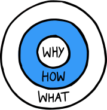
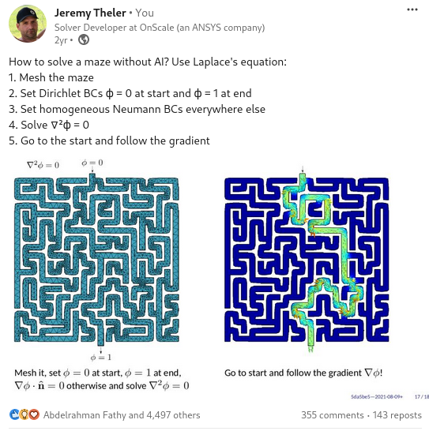

---
title: Transporte de neutrones en la nube
subtitle: Tesis de Doctorado en Ingeniería Nuclear
author: Mg. Ing. Germán Theler
institute: Instituto Balseiro
aspectratio: 169
lang: es-AR
theme: default
innertheme: rectangles
fonttheme: professionalfonts
outertheme: number
colorlinks: true
sansfont: Carlito
monofont: DejaVuSansMono
header-includes:
  - \newcommand{\omegaversor}{\hat{\symbf{\Omega}}}
  - \newcommand{\omegaprimaversor}{\hat{\symbf{\Omega}}^\prime}
  - \renewcommand{\vec}[1]{\mathbf{#1}}
  - \newcommand{\mat}[1]{\mathsf{#1}}
  - \renewcommand\spanishtablename{Tabla}
  - \input{syntax-feenox.tex}
  - \input{syntax.tex}
...


## 

\centering 

## 

\centering
{height=5.75cm}
{height=5.75cm}

## 

\centering 


## 

\centering 

## 

\centering 

## 

\centering 

## 

\centering 


## 

\centering 


## 

```{=latex}
\begin{center}
\small{A cloud-first approach for solving core-level neutron transport over unstructured grids}
\end{center}
```

\medskip

. . .


$$
\underbrace{\text{Transporte de neutrones}}_\text{física de reactores}
\underbrace{\text{en la nube}}_\text{programación}
$$

. . .

\medskip


:::::::::::::: {.columns}
::: {.column width="22%"}
:::

::: {.column width="46%"}

\vspace{0.6cm}

 1. Introducción

\vspace{1.05cm}

 2. Transporte y difusión de neutrones
 3. Esquemas de discretización numérica

\vspace{0.95cm}

 4. Implementación computacional
 5. Resultados

:::

::: {.column width="10%"}

$$
\left.
\begin{matrix} ~ \end{matrix}
\right\} \text{Why}
$$

$$
\left.
\begin{matrix} ~ \\ ~ \end{matrix}
\right\} \text{How}
$$


$$
\left.
\begin{matrix} ~ \\ ~ \end{matrix}
\right\} \text{What}
$$

:::

::: {.column width="22%"}
:::

::::::::::::::


## 

\centering 


## Cien años de programación


 Computer | Monthly Rental  | Relative Speed | First Delivery 
:----------------|:------------------------:|:-----------:|:-----------:
 CDC 3800        |         $ 50,000         |     1       |  Jan 66
 CDC 6600        |         $ 80,000         |     6       |  Sep 64
 CDC 6800        |         $ 85,000         |     20      |  Jul 67
 GE 635          |         $ 55,000         |     1       |  Nov 64
 IBM 360/62      |         $ 58,000         |     1       |  Nov 65
 IBM 360/70      |         $ 80,000         |     2       |  Nov 65
 IBM 360/92      |         $ 142,000        |     20      |  Nov 66
 PHILCO 213      |         $ 78,000         |     2       |  Sep 65
 UNIVAC 1108     |         $ 45,000         |     2       |  Aug 65

: "Recent developments in computers and their implication for reactor calculations" (1965)^[1 USD @ 1965 $\approx$ 10 USD @ 2023]

## Unix rule of silence

## Historia de dos reactores


## Inyección rápida de boro: esquema de dos pasos


## Inyección rápida de boro: esquema acoplado con cinética espacial


## Inyección rápida de boro: esquema acoplado con cinética espacial


## Los canales de los PHWR

:::::::::::::: {.columns}
::: {.column width="45%"}


\centering Atucha

:::

::: {.column width="10%"}
:::

::: {.column width="45%"}


\centering CANDU

:::
::::::::::::::


## 

:::::::::::::: {.columns}
::: {.column width="45%"}

:::

::: {.column width="10%"}
. . . 
:::

::: {.column width="45%"}

:::
::::::::::::::

. . . 

:::::::::::::: {.columns}
::: {.column width="45%"}

:::

::: {.column width="10%"}
. . . 
:::

::: {.column width="45%"}

:::
::::::::::::::


## Celdas estructuradas...

:::::::::::::: {.columns}
::: {.column width="50%"}


\centering de representación
:::

::: {.column width="50%"}


\centering de cálculo
:::
::::::::::::::


## 

\centering 

## 

\centering 


## 

\centering 

## 

:::::::::::::: {.columns}
::: {.column width="50%"}

\centering 

\centering +

\centering {width=60%}

:::

. . .

::: {.column width="50%"}

\centering 

:::
::::::::::::::

## 

\centering 


## 

\centering 


. . . 


\centering ¿Vale usar difusión?

  

 
## Limitaciones


 i. dilución de XS por mismatch de mallas CFD/neutrónica
 
 ii. efecto staircase al modelar canales circulares
 
 iii. cuestionable validez de difusión
 
\bigskip 
 
. . .

### La propuesta de esta tesis


$$
\text{difusión} \rightarrow \text{muy simplificado} \Rightarrow S_N \rightarrow \text{escala muy rápido} \Rightarrow \text{esquema}
\begin{cases}
 \text{paralelizable} \\
 \text{flexible} \\
 \text{extensible}
\end{cases}
$$

. . .

$$
\text{paralelizable} \rightarrow \text{descomposición de dominio} \rightarrow \text{DAG} = \text{malla no estructurada}
$$


## IAEA 3D PWR Benchmark (1976)

:::::::::::::: {.columns}
::: {.column width="50%"}

:::

::: {.column width="50%"}

:::
::::::::::::::

## 

:::::::::::::: {.columns}
::: {.column width="56%"}

:::

::: {.column width="44%"}
\vspace{0.6cm}

:::
::::::::::::::


## 

:::::::::::::: {.columns}
::: {.column width="56%"}

:::

::: {.column width="44%"}
\vspace{0.6cm}

:::
::::::::::::::


## 

:::::::::::::: {.columns}
::: {.column width="56%"}

:::

::: {.column width="44%"}
\vspace{0.6cm}

:::
::::::::::::::

## IAEA 3D PWR Benchmark con 1/8, reflector circular & S$_4$ (2023)

:::::::::::::: {.columns}
::: {.column width="50%"}
\centering {height=8cm}
:::

::: {.column width="50%"}
\centering  {height=8cm}
:::
::::::::::::::


## 

\centering 


## 

:::::::::::::: {.columns}
::: {.column width="20%"}

\vspace{1cm}

\centering 

Lucio Séneca

4 a.C.---65 d.C.
:::

::: {.column width="80%"}

> No debemos tan sólo escribir ni tan sólo leer.
> Hay que acudir a la vez a lo uno y a lo otro, y combinar ambos ejercicios a fin de que, cuantos pensamientos ha recogido la lectura, los reduzca a la unidad.
>
> \medskip
>
> Lo que comprobamos que realiza en nuestro cuerpo la naturaleza sin ninguna colaboración nuestra, es eso lo que tenemos que hacer con la lectura. Los alimentos que tomamos, mientras mantienen su propia cualidad y compactos flotan en el estómago, son una carga.
> Mas cuando se ha producido su trasformación, entonces y sólo entonces, se convierten en fuerza y sangre.
> Procuremos otro tanto con los alimentos que nutren nuestro espíritu.
> No permitamos que queden intactos cuántos hayamos ingerido para que no resulten ajenos a nosotros.
> Asimilémoslos. De otra suerte, irán al acervo de la memoria y no al de la inteligencia.
>
> \medskip
>
> ¿Cómo lograr esto te preguntas? Con una constante aplicación.
>
>

:::
::::::::::::::

## 2. Transporte y difusión de neutrones

:::::::::::::: {.columns}
::: {.column width="50%"}

 1. Secciones eficaces
    1. Dispersión de neutrones
    2. Expansión en polinomios de Legendre
    3. Fisión de neutrones
 2. Flujos y ritmos de reacción
 3. Transporte de neutrones
    1. Operador de transporte
    2. Operador de desapariciones
    3. Operador de producciones
    4. La ecuación de transporte
    5. Armónicos esféricos y polinomios de Legendre
    6. Transporte linealmente anisótropo en estado estacionario
    7. Condiciones iniciales y de contorno
    
:::
::: {.column width="50%"}
    
    
 4. Aproximación de difusión
    1. Momento de orden cero
    2. Momento de orden uno
    3. Ley de Fick
    4. La ecuación de difusión
    5. Condiciones de contorno
 5. Esquema de solución multi-escala
    1. Evaluación y procesamiento de secciones eficaces
    2. Cálculo a nivel celda
    3. Cálculo a nivel núcleo
    
. . .

\medskip

\centering 


<https://github.com/gtheler/thesis>

:::
::::::::::::::

## Ecuación de transporte

$$
\begin{gathered}
 \sqrt{\frac{m}{2E}} \frac{\partial}{\partial t} \Big[ \psi(\vec{x}, \omegaversor, E, t) \Big]
 + \omegaversor \cdot \text{grad} \left[ \psi(\vec{x}, \omegaversor, E, t) \right]
 + \Sigma_t(\vec{x}, E) \cdot \psi(\vec{x}, \omegaversor, E, t) = \\
 \int_{0}^{\infty} \int_{4\pi} \Sigma_s(\vec{x}, \omegaprimaversor \rightarrow \omegaversor, E^\prime \rightarrow E) \cdot \psi(\vec{x}, \omegaprimaversor, E^\prime, t) \, d\omegaprimaversor \, dE^\prime \\
+ \frac{\chi(E)}{4\pi} \int_{0}^{\infty} \int_{4\pi} \nu\Sigma_f(\vec{x}, E^\prime) \cdot \psi(\vec{x}, \omegaprimaversor, E^\prime, t) \, d\omegaprimaversor \, dE^\prime 
+ s(\vec{x}, \omegaversor, E, t)
\end{gathered}
$$

## Expansión en armónicos esféricos

\centering {height=8cm}


## Transporte linealmente anisótropo en estado estacionario

$$
\begin{gathered}
 \omegaversor \cdot \text{grad} \left[ \psi(\vec{x}, \omegaversor, E) \right]
 + \Sigma_t(\vec{x}, E) \cdot \psi(\vec{x}, \omegaversor, E) = \\
\frac{1}{4\pi} \cdot 
\int_{0}^{\infty} \Sigma_{s_0}(\vec{x}, E^{\prime} \rightarrow E) \cdot \int_{4\pi} \psi(\vec{x}, \omegaprimaversor, E^{\prime}) \, d\omegaprimaversor \, dE^\prime + \\
\frac{3 \cdot \omegaversor}{4\pi} \cdot
\int_{0}^{\infty} \Sigma_{s_1}(\vec{x}, E^{\prime} \rightarrow E) \cdot \int_{4\pi} \psi(\vec{x}, \omegaprimaversor, E^{\prime}) \cdot \omegaprimaversor \, d\omegaprimaversor \, dE^\prime  \\
+ \frac{\chi(E)}{4\pi} \int_{0}^{\infty} \nu\Sigma_f(\vec{x}, E^\prime) \cdot \phi(\vec{x}, E^\prime) \, dE^\prime 
+ s(\vec{x}, \omegaversor, E)
\end{gathered}
$$


## Aproximación de difusión

 i.
    
    a. el problema sea estacionario, o    
    b. que $\frac{3}{v}  \frac{\partial \vec{J}}{\partial t} \ll \text{grad} \left[ \phi(\vec{x}, E,t ) \right]$

\medskip
    
 ii.
 
     a. no haya fuentes independientes, o
     b. que la fuente independiente sea isótropa

\medskip
          
     
 iii.
 
      a. el scattering sea isótropo (en el marco de referencia del reactor), o
      b. que $\int_0^\infty \Sigma_{s_1}(\vec{x}, E^\prime \rightarrow E) \cdot \vec{J}(\vec{x}, E^\prime, t) \, dE^\prime \simeq \int_0^\infty \Sigma_{s_1}(\vec{x}, E \rightarrow E^\prime) \cdot \vec{J}(\vec{x}, E, t) \, dE^\prime$


$$
\begin{gathered}
 - \text{div} \Big[ D(\vec{x}, E) \cdot \text{grad} \left[ \phi(\vec{x}, E) \right] \Big]
 + \Sigma_t(\vec{x}, E) \cdot \phi(\vec{x}, E)
 = \\
\int_{0}^{\infty} \Sigma_{s_0}(\vec{x}, E^{\prime} \rightarrow E)  \cdot \phi(\vec{x}, E^\prime) \, dE^\prime +
\chi(E) \int_{0}^{\infty} \nu\Sigma_f(\vec{x}, E^\prime) \cdot \phi(\vec{x}, E^\prime) \, dE^\prime
+ s_0(\vec{x}, E)
\end{gathered}
$$


## 


:::::::::::::: {.columns}
::: {.column width="25%"}

\vspace{1cm}

\centering 

Paul Graham

1964--
:::

::: {.column width="75%"}

\vspace{1cm}

> You can know a great deal about something without writing about it. Can you ever know so much that you wouldn't learn more from trying to explain what you know? I don't think so. I've written about at least two subjects I know well---Lisp hacking and startups---and in both cases I learned a lot from writing about them.^[Machinery and circuits are formal languages.] In both cases there were things I didn't consciously realize till I had to explain them. And I don't think my experience was anomalous. A great deal of knowledge is unconscious, and experts have if anything a higher proportion of unconscious knowledge than beginners.
>

:::
::::::::::::::


## 3. Esquemas de discretización numérica

### Discretización en energía: multi-grupo

{width=100%}

. . .

### Discretización en ángulo: ordenadas discretas

:::::::::::::: {.columns}
::: {.column width="25%"}

:::
::: {.column width="25%"}

:::
::: {.column width="25%"}

:::
::: {.column width="20%"}

:::
::::::::::::::


## Cuadraturas de nivel simétrico


:::::::::::::: {.columns}
::: {.column width="25%"}
```sn


       1    
```

:::
::: {.column width="25%"}
```sn

       1   
      1 1  
```

:::
::: {.column width="25%"}
```sn 

       1   
      2 2  
     1 2 1 
```
:::
::: {.column width="20%"}
```sn  
       1   
      2 2  
     2 3 2 
    1 2 2 1
```

:::
::::::::::::::

:::::::::::::: {.columns}
::: {.column width="25%"}
```sn    


       1    
      2 2   
     3 4 3  
    2 4 4 2 
   1 2 3 2 1
```
:::
::: {.column width="25%"}
```sn      

       1     
      2 2    
     3 4 3   
    3 5 5 3  
   2 4 5 4 2 
  1 2 3 3 2 1
```
:::
::: {.column width="25%"}
```sn

       1      
      2 2     
     3 5 3    
    4 6 6 4   
   3 6 7 6 3  
  2 5 6 6 5 2 
 1 2 3 4 3 2 1
```
:::
::: {.column width="20%"}

```sn          
       1       
      2 2      
     3 5 3     
    4 6 6 4    
   4 7 8 7 4   
  3 6 8 8 6 3  
 2 5 6 7 6 5 2 
1 2 3 4 4 3 2 1
```
:::
::::::::::::::

## Discretización en espacio: elementos finitos

$$
\begin{cases}
-\text{div} \Big[ k(\vec{x}) \cdot \text{grad} \left[ u(\vec{x}) \right] \Big] = f(\vec{x}) & \forall\vec{x} \in U \\
u(\vec{x}) = 0 & \forall \vec{x} \in \Gamma_D \\
k(\vec{x}) \cdot \Big[ \text{grad} \left[ u(\vec{x}) \right] \cdot \hat{\vec{n}} \Big] = p(\vec{x}) & \forall \vec{x} \in \Gamma_N
\end{cases}
$$

. . .

$$
\int_U \text{grad} \left[ v(\vec{x}) \right] \cdot k(\vec{x}) \cdot \text{grad} \left[ u(\vec{x}) \right]  \,d^D\vec{x}
=
\int_U v(\vec{x}) \cdot f(\vec{x}) \,d^D\vec{x}
+ \int_{\Gamma_N} p(\vec{x}) \cdot v(\vec{x}) \,d^{D-1}\vec{x}
$$


$$
\text{encontrar~} u(\vec{x}) \in V: \quad
\mathcal{a} \Big(u(\vec{x}), v(\vec{x})\Big) = \mathcal{B} \Big(v(\vec{x})\Big)
\quad  \forall v(\vec{x}) \in V
$$

$$
\begin{aligned}
\mathcal{a}(u,v) &= \int_U \text{grad}\Big[ v(\vec{x}) \Big] \cdot k(\vec{x}) \cdot \text{grad}\Big[ u(\vec{x}) \Big] \, d^D \vec{x} \\
\mathcal{B}(v) &= \int_U v(\vec{x}) \cdot f(\vec{x}) \, d^D \vec{x} + \int_{\Gamma_N} v(\vec{x}) \cdot p(\vec{x}) \, d^{D-1} \vec{x}
\end{aligned}
$$

## Discretización en espacio: elementos finitos


## Discretización en espacio: elementos finitos


## Discretización en espacio: elementos finitos

:::::::::::::: {.columns}
::: {.column width="50%"}

:::
::: {.column width="50%"}

:::
::::::::::::::

:::::::::::::: {.columns}
::: {.column width="50%"}

:::
::: {.column width="50%"}

:::
::::::::::::::


## Discretización en espacio: elementos finitos


## Discretización en espacio: elementos finitos

$$
\mat{K} \cdot \vec{u} = \vec{b}
$$

\vspace{-0.75cm}

$$
\mat{K}_i \approx
\sum_{q=1}^Q 
\underbrace{\omega_q \cdot \Big|\det{\left[\mat{J}_i\left(\symbf{\xi}_q\right)\right]}\Big|}_{\text{cuadratura numérica sobre $e_c$}}
\underbrace{\left\{ \mat{B}_i^T(\symbf{\xi}_q) \cdot k(\vec{x}_q) \cdot \mat{B}_i(\symbf{\xi}_q) \right\}}_{\text{discretización del operador $-\text{div}(k \cdot \nabla u)$}}
$$

$$
\vec{b}_i
\approx
\sum_{q=1}^Q
\underbrace{\omega_q \cdot \Big|\det{\left[\mat{J}_i\left(\symbf{\xi}_q\right)\right]}\Big|}_{\text{cuadratura numérica sobre $e_c$}}
\underbrace{\left\{\mat{H}_c^T(\symbf{\xi}_q) \cdot f(\vec{x}_q)\right\}}_{\text{discretización del miembro derecho $f$}}
$$

\medskip
. . .

\vspace{-0.8cm}


## Extras

### Elementos de segundo orden

:::::::::::::: {.columns}
::: {.column width="50%"}

:::
::: {.column width="50%"}

:::
::::::::::::::


. . . 


### Condiciones de Dirichlet no homogéneas

 * Prueba de que usar `MatZeroRows()` (o `MatZeroRowsColumns()`) es correcto (páginas 124--126)

<https://scicomp.stackexchange.com/questions/5072/how-to-properly-apply-non-homogeneous-dirichlet-boundary-conditions-with-fem>

 * Segunda respuesta más votada (después de la de Jed Brown)


## Difusión de neutrones multigrupo en estado estacionario

$$ 
\begin{gathered}
 - \text{div} \Big[ D_g(\vec{x}) \cdot \text{grad} \left[ \phi_g(\vec{x}) \right] \Big]
 + \Sigma_{t g}(\vec{x}) \cdot \phi_g(\vec{x})
 = \\
\sum_{g^\prime = 1}^G \Sigma_{s_0 g^\prime \rightarrow g}(\vec{x})  \cdot \phi_{g^\prime}(\vec{x}) +
\chi_g \sum_{g^\prime = 1}^G \nu\Sigma_{fg^\prime}(\vec{x}) \cdot \phi_{g^\prime}(\vec{x})+ s_{0g}(\vec{x})
\end{gathered}
$$ 


$$
\begin{aligned}
\mat{K}_i &= 
\sum_{q=1}^Q \omega_q \cdot \Big|\det{\left[\mat{J}_i\left(\symbf{\xi}_q\right)\right]}\Big| \cdot \left[ \mat{L}_i(\symbf{\xi}_q) + \mat{A}_i(\symbf{\xi}_q) - \mat{F}_i(\symbf{\xi}_q)\right]
\end{aligned}
$$

\vspace{-0.5cm}

$$
\begin{aligned}
\mat{L}_i &= \mat{B}_{Gi}^T(\symbf{\xi}_q) \cdot \mat{D}_D(\symbf{\xi}_q) \cdot \mat{B}_{Gi}(\symbf{\xi}_q)  \\
\mat{A}_i &= \mat{H}_{Gc}^T(\symbf{\xi}_q) \cdot \mat{R}(\symbf{\xi}_q) \cdot \mat{H}_{Gc}(\symbf{\xi}_q) \\
\mat{F}_i &= \mat{H}_{Gc}^T(\symbf{\xi}_q) \cdot \mat{X}(\symbf{\xi}_q) \cdot \mat{H}_{Gc}(\symbf{\xi}_q)
\end{aligned}
$$

$$
\begin{aligned}
\vec{b}_i &= 
\sum_{q=1}^Q \omega_q \cdot \Big|\det{\left[\mat{J}_i\left(\symbf{\xi}_q\right)\right]}\Big| \cdot \left[  \mat{H}_c^T(\symbf{\xi}_q) \cdot \vec{s}(\vec{x}_q)   \right]
\end{aligned}
$$

## Ordenadas discretas en estado estacionario

$$
\begin{gathered}
\omegaversor_m \cdot \text{grad} \left[ \psi_{mg}(\vec{x}) \right]  +
\Sigma_{t g}(\vec{x}) \cdot \psi_{mg}(\vec{x}) = s_{mg}(\vec{x}) +
\sum_{g=1}^G \Sigma_{s_0 g^\prime \rightarrow g}(\vec{x})  \sum_{m^\prime=1} w_{m^\prime} \psi_{m^\prime g^\prime}(\vec{x})  + \\
3 \sum_{g=1}^G \Sigma_{s_1 g^\prime \rightarrow g}(\vec{x}) \sum_{m^\prime=1} w_{m^\prime} \left( \omegaversor_{m} \cdot \omegaversor_{m^\prime} \right) \psi_{m^\prime g^\prime}(\vec{x}) + 
\chi_g \sum_{g^\prime=1}^G \nu\Sigma_{fg^\prime}(\vec{x})   \sum_{m^\prime=1} w_{m^\prime} \psi_{m^\prime g^\prime}(\vec{x}) 
\end{gathered}
$$

$$
\begin{aligned}
\mat{K}_i &= 
\sum_{q=1}^Q \omega_q \cdot \Big|\det{\left[\mat{J}_i\left(\symbf{\xi}_q\right)\right]}\Big| \cdot \left[ \mat{L}_i(\symbf{\xi}_q) + \mat{A}_i(\symbf{\xi}_q) - \mat{F}_i(\symbf{\xi}_q)\right]
\end{aligned}
$$

$$
\begin{aligned}
\mat{L}_i &= \mat{P}_{MGc}^T(\symbf{\xi}_q) \cdot \mat{D} \cdot \mat{H}_{MGc}(\symbf{\xi}_q)  \\
\mat{A}_i &= \mat{P}_{MGc}^T(\symbf{\xi}_q)^T \cdot \mat{R}(\symbf{\xi}_q) \cdot \mat{H}_{MGc}(\symbf{\xi}_q) \\
\mat{F}_i &= \mat{P}_{MGc}^T(\symbf{\xi}_q)^T \cdot \mat{X}(\symbf{\xi}_q) \cdot \mat{H}_{MGc}(\symbf{\xi}_q)
\end{aligned}
$$


## Transporte de neutrones en estado estacionario


 1. Medio no multiplicativo con fuentes independientes,
 
    $$
    \text{matriz de} \left[ \text{leakage} + \text{absorciones} \right] \cdot \symbf{\varphi} = \text{vector de} \left[ \text{fuentes} \right]
    $$
 
. . . 
 
 2. Medio multiplicativo con fuentes independientes, y
 
    $$
    \text{matriz de} \left[ \text{leakage} + \text{absorciones} - \text{fisiones} \right] \cdot \symbf{\varphi} = \text{vector de} \left[ \text{fuentes} \right]
    $$

. . .
     
 3. Medio multiplicativo sin fuentes independientes.
 
    $$
    \text{matriz de} \left[ \text{leakage} + \text{absorciones} \right] \cdot \symbf{\varphi} = \frac{1}{k_\text{eff}} \cdot \text{matriz de} \left[ \text{fisiones} \right] \cdot \symbf{\varphi}
    $$

. . .

 * Si las XSs dependen de $\symbf{\varphi}$ hacemos lo mismo pero con Newton-Raphson (otro día)

## 

\centering 

## 

```{=latex}
\begin{center}
```


```{=latex}
\end{center}
```


## 


## 

 


## 

{width=50%}
{width=45%} 

## 

```{=latex}
\begin{center}
```

{width=60%}

```{=latex}
\end{center}
```


## 

:::::::::::::: {.columns}
::: {.column width="25%"}

:::

. . .

::: {.column width="25%"}

:::

. . .

::: {.column width="25%"}

:::

::: {.column width="25%"}

:::
::::::::::::::


## 

\centering 

## 

:::::::::::::: {.columns}
::: {.column width="33%"}
\centering {height=1.5cm}

\centering {height=6.5cm}
:::

. . .

::: {.column width="33%"}
\centering 

\centering {height=2.5cm} {height=2.5cm} {height=2.5cm} {height=2.5cm}

\centering 
:::

. . .

::: {.column width="33%"}

\vspace{2cm}

{height=7cm}

:::
::::::::::::::

## 

\centering {height=9cm}

## 


## Software Requirements Specification $\rightarrow$ Software Design Specification

. . .

:::::::::::::: {.columns}
::: {.column width="10%"}
:::

::: {.column width="40%"}

 1. Introduction
     1. Objective
     2. Scope
 2. Architecture
     1. Deployment
     2. Execution
     3. Efficiency
     4. Scalability
     5. Flexibility
     6. Extensibility
     7. Interoperability
:::

::: {.column width="45%"}
     
 3. Interfaces
     1. Problem input
     2. Results output
 4. Quality assurance
     1. Reproducibility and traceability
     2. Automated testing
     3. Bug reporting and tracking
     4. Verification
     5. Validation
     6. Documentation
:::
    
::: {.column width="5%"}
:::
     
::::::::::::::

    

## FeenoX: a cloud-first finite-element(ish) computational engineering tool

:::::::::::::: {.columns}
::: {.column width="25%"}

:::
::: {.column width="25%"}

:::
::: {.column width="25%"}

:::
::: {.column width="25%"}

:::
::::::::::::::


\centering 


## Unfair advantage: Markdown

 Feature                               |     Microsoft Word    |       Google Docs    |      Markdown[^1]  |     (La)TeX
:--------------------------------------|:---------------------:|:--------------------:|:------------------:|:----------------:
 Aesthetics                            |       \textcolor{red}{$\times$}        |       \textcolor{red}{$\times$}       |      \textcolor{OliveGreen}{$\checkmark$}      |  \textcolor{OliveGreen}{$\checkmark$}
 Convertibility                        |       $\sim$          |       $\sim$         |      \textcolor{OliveGreen}{$\checkmark$}      |  $\sim$
 Traceability                          |       \textcolor{red}{$\times$}        |       $\sim$         |      \textcolor{OliveGreen}{$\checkmark$}      |  \textcolor{OliveGreen}{$\checkmark$}
 Mobile-friendliness                   |       \textcolor{red}{$\times$}        |       \textcolor{OliveGreen}{$\checkmark$}       |      \textcolor{OliveGreen}{$\checkmark$}      |  \textcolor{red}{$\times$}
 Collaborativeness                     |       \textcolor{red}{$\times$}        |       \textcolor{OliveGreen}{$\checkmark$}       |      \textcolor{OliveGreen}{$\checkmark$}      |  $\sim$
 Licensing/openness                    |       \textcolor{red}{$\times$}        |       \textcolor{red}{$\times$}       |      \textcolor{OliveGreen}{$\checkmark$}      |  \textcolor{OliveGreen}{$\checkmark$}
 Non-nerd friendliness                 |       \textcolor{OliveGreen}{$\checkmark$}        |       \textcolor{OliveGreen}{$\checkmark$}       |      $\sim$        |  \textcolor{red}{$\times$}

[^1]: Here “[Markdown](https://en.wikipedia.org/wiki/Markdown)” means ([Pandoc](https://pandoc.org/) + [Git](https://git-scm.com/) + [Github](https://github.com/) / [Gitlab](https://about.gitlab.com/) / [Gitea](https://gitea.com/}{Gitea}))

 
## Unfair advantage: FeenoX

 Feature                           | Desktop GUIs  |   Web frontends  |  FeenoX[^2]  |  Libraries
:--------------------------------------|:------------------------:|:-----------------------:|:------------------:|:----------------:
 Flexibility                           |      $\sim$              |         \textcolor{red}{$\times$}        |     \textcolor{OliveGreen}{$\checkmark$}       |      \textcolor{OliveGreen}{$\checkmark$}
 Scalability                           |      \textcolor{red}{$\times$}            |         $\sim$          |     \textcolor{OliveGreen}{$\checkmark$}       |      \textcolor{OliveGreen}{$\checkmark$}
 Traceability                          |      \textcolor{red}{$\times$}            |         $\sim$          |     \textcolor{OliveGreen}{$\checkmark$}       |      \textcolor{OliveGreen}{$\checkmark$}
 Cloud-friendliness                    |      \textcolor{red}{$\times$}            |         \textcolor{OliveGreen}{$\checkmark$}        |     \textcolor{OliveGreen}{$\checkmark$}       |      \textcolor{OliveGreen}{$\checkmark$}
 Collaborativeness                     |      \textcolor{red}{$\times$}            |         \textcolor{OliveGreen}{$\checkmark$}        |     \textcolor{OliveGreen}{$\checkmark$}       |      $\sim$
 Licensing/openness                    | \textcolor{OliveGreen}{$\checkmark$}/$\sim$/\textcolor{red}{$\times$} |         \textcolor{red}{$\times$}        |     \textcolor{OliveGreen}{$\checkmark$}       |      \textcolor{OliveGreen}{$\checkmark$}
 Non-nerd friendliness                 |      \textcolor{OliveGreen}{$\checkmark$}            |         \textcolor{OliveGreen}{$\checkmark$}        |     $\sim$         |      \textcolor{red}{$\times$}

[^2]: Here “FeenoX” means ([FeenoX](https://seamplex.com/feenox) + [Gmsh](http://gmsh.info) + [Paraview](https://www.paraview.org/) + [Git](https://git-scm.com/) + [Github](https://github.com/) / [Gitlab](https://about.gitlab.com/) / [Gitea](https://gitea.com/}{Gitea}))
 
## Licensing (sec. 4.3.1 & ap. B.1)


:::::::::::::: {.columns}

::: {.column width="20%"}

\onslide<2->{\includegraphics{rms.jpg}}

\onslide<3->{\includegraphics{esr.jpg}}


:::


::: {.column width="80%"}

 * FeenoX es GPLv3+ = libre & abierto
   - free $\neq$ gratis
   
     - "Free" as in "free speech" not as in "free beer"
     - Hay software gratis que no es libre
     - Hay software que se dice "abierto" pero que no lo es
     - El software libre puede terminar siendo caro
     - Lo opuesto de "software libre" *NO* es "software comercial"
     
   - free $\neq$ open (pero casi)

. . .
    
 * Software libre = bases éticas
   - GNU Manifesto (1985)
   - Cuatro libertades básicas
 
. . . 

 * Open source = bases tecnicas
   - The Cathedral and the Bazaar (1998)
   - Given enough eyeballs all bugs are shallow

. . .

\medskip

 * A caballo regalado no se le miran los dientes.
 * Cuando la limosna es grande, hasta el santo desconfía.

:::
::::::::::::::

 

## Scope (ap. B.2)

:::::::::::::: {.columns}
::: {.column width="65%"}

### Third-system effect

 * v1: milonga
 
   \centering {height=1cm}
   
. . .
 
 * v2: wasora, Fino, mochin, besssugo, waspy, xdfrrpf, ...
 
   \centering {height=2cm} {height=2cm} {height=2cm}
   
. . .
 
 * v3: FeenoX
 
   \centering {height=2cm}
 
. . .
:::

::: {.column width="35%"}

[seamplex.com/feenox/examples](https://www.seamplex.com/feenox/examples/)

\bigskip

 #. [Basic mathematics](https://www.seamplex.com/feenox/examples/basic.html)
 #. [Systems of ODEs/DAEs](https://www.seamplex.com/feenox/examples/daes.html)
 #. [Laplace’s equation](https://www.seamplex.com/feenox/examples/laplace.html)
 #. [Heat conduction](https://www.seamplex.com/feenox/examples/thermal.html)
 #. [Linear elasticity](https://www.seamplex.com/feenox/examples/mechanical.html)
 #. [Modal analysis](https://www.seamplex.com/feenox/examples/modal.html)
 #. [Neutron diffusion](https://www.seamplex.com/feenox/examples/neutron_diffusion.html)
 #. [Neutron S$_N$](https://www.seamplex.com/feenox/examples/neutron_sn.html)
 
 * ... `src/pdes`
:::
::::::::::::::

 
## Unix philosophy (sec 4.3.2, ap. B.1.2 & ap. C)

:::: {lang=en-US}
 i. Make each program do one thing well. To do a new job, build afresh rather than complicate old programs by adding new features.
 ii. Expect the output of every program to become the input to another, as yet unknown, program.
     * Don't clutter output with extraneous information.
     * Avoid stringently columnar or binary input formats.
     * Don't insist on interactive input.

 * This is the Unix philosophy: Write programs that do one thing and do it well. Write programs to work together. Write programs to handle text streams, because that is a universal interface.
::::

. . .

```
                             +------------+
 mesh (*.msh)  }             |            |             { terminal
 data (*.dat)  } input ----> |   FeenoX   |----> output { data files
 input (*.fee) }             |            |             { post (vtk/msh)
                             +------------+
```

## Las 17 reglas (apéndice C)

:::::::::::::: {.columns}
::: {.column width="30%"}

 #. Rule of Modularity
 #. Rule of Clarity
 #. **Rule of Composition**
 #. **Rule of Separation**
 #. **Rule of Simplicity**
 #. **Rule of Parsimony**
 #. **Rule of Transparency**
 #. Rule of Robustness
 #. Rule of Representation
 #. Rule of Least Surprise
 #. Rule of Silence
 #. Rule of Repair
 #. **Rule of Economy**
 #. **Rule of Generation**
 #. Rule of Optimization
 #. **Rule of Diversity**
 #. Rule of Extensibility
:::

. . .

::: {.column width="70%"}

 * Script & macro friendly (simulación programática)
 
   - play along con otras herramientas
   - optimizador
   - mallador
   - post-procesador
 
 * UI/UX friendly (desktop, web, VR?)
 
   - separar front de back end
   - inputs fáciles de generar
     - m4? sed? Awk? PHP?
 
 * Parametric & optimization runs
 
   ```feenox
   PRINT "Hello $1"
   ```
    
   ```terminal
   $ for i in $(seq 1 3); do feenox hello.fee $i; done
   Hello 1
   Hello 2
   Hello 3
   $ 
   ```

:::

::::::::::::::


## 

\centering 

 


## La "nube" (sec. 4.3.6  & ap. B.1)

:::::::::::::: {.columns}
::: {.column width="60%"}

\centering 

:::

::: {.column width="40%"}

 * Somebody else's computer(s)
 * Rent, don't buy!
 * Pay as you go
 * CAPEX $\rightarrow$ OPEX

\medskip 
. . .

 * Cloud first $\neq$ cloud friendly 
   - Deployment
   - APIs
   - Autenticación
   - Thin clients
   - ...

\medskip 
. . .
 
\centering “Desktop solver development is the **opposite** of cloud development”
 
:::
::::::::::::::


## 

\centering {height=8cm}

<https://www.caeplex.com>

 
## 

\centering 

developer easy / user hard

## 

:::::::::::::: {.columns}
::: {.column width="30%"}

\vspace{0.5cm}

\centering 
:::

::: {.column width="70%"}
\centering {height=7cm}

4,498 likes, 355 comments & 143 reposts
:::
::::::::::::::

\centering <https://seamplex.com/feenox/doc/tutorials/120-mazes/>


 
 
## Arquitectura

¿qué hay que hacer?

 1. construir K & b
 2. resolver K u = b -> Petsc

FeenoX se enfoca en 1
 
fig. transfer glue

## Languages

en orden cronológico

> Add complexity only where you must.

 * Fortran -> complejidad innecesaria
 * C
 * C++ - complejidad innecesaria
 * Rust

## Algoritmos

para construir K poisson
para neutrónica es lo mismo

la pde está dada por las llaves

podemos hacer una cáscara?

## 

¿Qué necesitamos?

 i.
 ii.
 iii.
 iv. 
 
p 169, los primeros 3 no dependen de la podemos
iv sí pero es evaluar materiales y BCs

=> sí podemos separar en framework + particular

## Implementación

Posible implementación

if pde == algo
 asdas 
 
p 171

para cada q para cada i

 1. feo
 2. ineficiente
 3. dificil de mantener

## Polimorfismo con apuntadores a función

C++ clases
C, function pointers

Un único if feo, ineficiente y dificil de mantener

 1. lo genera un script al que no le importa la belleza ni la mantención
 2. es uno sólo en toda la ejecución

mostramos autogen? sí

## Input

input, decisión de diseño

 * english-like
 * self-descriptive
 * etc.
 
 * macro friendly
 * git friendly
 
p 173 
  
 1. 
 2. 
 3. 
 4. 
 5. 
 
 
## Instrucciones y definiciones

 a. definiciones (sustantivos) -> parse time
 b. instrucciones (verbos) -> run time with an actual IP
 
## Conducción de calor 1D

p 175

 1. 
 2.  
 3. 
 
columns

p 176

## Non-uniform k

1+x


1+T

## Reed

feenox reed.fee 2
4
6
8

## Entry points

PROBLEM neutron_sn dim xxxx

p 182

p 185

PRINT

## Entry points para

 1. parse
 2. init
 3. build
 4. solution, TS, SNES, KSP, EPS
 5. post
 
show the header p 184

## IAEA

momento 1/phi = 28 min

resolver 2d iaea
borrar src/pdes/diff
recompilar
make check

mostrar que no existe mas dif

cambiar un signo
recompilar
make check

## Algoritmos auxiliares

## Everything's an expression

funcionales

p 195

comparar soluciones analíticas

## Funciones ($\neq$ "tabla")

least surprise

 1. algebra
 2. pointwise
    a. sin topología
    b. con topología implítica
    c. con topología explícita
    
## Output

Unix rule of silence!


## Otras cosas

 4.3.1. licencia
 4.3.2. unix
 4.3.3. sim prog
 4.3.4. performance
 4.3.5. escalabilidad
 4.3.6. cloud
 4.3.7. extensibilidad
 4.3.8. CI
 4.3.9. doc
 
## Escalabilidad


MPI = para memoria

Turing-complete se puede hacer, como? out-of-memory 


### Perfomance

le ganamos a casi todos, pero hay que volver

    
## TODO

secondary fields, gauss-node extrapolation

interpolation of pointwise data

ver qué más quedó afuera


## QA

CI

make check

doc


## 

                                           |    a    |    b    |    c    |    d
:------------------------------------------|:-------:|:-------:|:-------:|:-------:
 6.1. Mapeo en mallas no conformes         |    ●    |    ●    |         |    ○
 6.2. El problema de Reed                  |    ◌    |    ○    |    ●    |
 6.3. Benchmark PWR IAEA                   |    ○    |    ●    |         |    ○
 6.4. El problema de Azmy                  |    ●    |    ●    |    ●    |    ◌
 6.5. Benchmarks de Los Alamos             |    ●    |    ○    |    ●    |
 6.6. Slab a dos zonas                     |    ●    |    ●    |         |
 6.7. Reactor cubo-esfera                  |    ●    |    ●    |         |
 6.8. El problema de los pescaditos        |    ●    |    ●    |    ◌    |
 6.9. MMS con el Stanford bunny            |    ●    |    ●    |    ◌    |    ◌
 6.10. PHWR vertical con barras inclinadas |    ●    |    ●    |    ●    |    ●
 6.11. Cinética puntual                    |         |         |         |

:::::::::::::: {.columns}
::: {.column width="75%"}

 a. Filosofía Unix, integración en scripts y simulación programática
 b. Mallas no estructuradas
 c. Ordenadas discretas (además de difusión)
 d. Paralelización en varios nodos de cálculo con MPI

:::
::: {.column width="25%"}

 ● requerido  
 ○ recomendado  
 ◌ opcional

:::
::::::::::::::


## Conclusiones

:::::::::::::: {.columns}
::: {.column width="50%"}
\centering {width=70%}
:::

. . .

::: {.column width="50%"}
\centering {width=80%}
:::
::::::::::::::

. . .

\medskip
\centering Software Requirements Specification $\rightarrow$ Software Design Specification


## Unfair advantanges

:::::::::::::: {.columns}
::: {.column width="60%"}

 * herramienta libre y abierta (de suma importancia!)
 * [_cloud-first_]{lang=en-US} ($\neq$ [_cloud-friendly_]{lang=en-US})
 * paralelización MPI
 * [back end]{lang=en-US} para diferentes [front ends]{lang=en-US}
 * filosofía de diseño Unix (compatbile con [_cloud-first_]{lang=en-US})
 * interfaz amena para la simulación programática
 * flexible para propiedades materiales no triviales
 * tablitas vs. software tradicional y bibliotecas
 * extensible con apuntadores a funciones `src/pdes`

:::

. . .

::: {.column width="40%"}

\vspace{1cm}

 1. transporte con S$_N$
 2. mallas no estructuradas
 3. de tamaño arbitrario con MPI

:::
::::::::::::::

 
## Tweets / Mastodons

:::::::::::::: {.columns}
::: {.column width="10%"}

\bigskip


:::

::: {.column width="55%"}

 * cloud first != cloud friendly
 * free != gratis
 * MPI != speed
 * extensibilidad con `src/pdes`
 * lo que Markdown es a Word, Docs & TeX

:::

::: {.column width="15%"}

:::

::: {.column width="15%"}

:::

::::::::::::::

\vspace{1cm}

:::::::::::::: {.columns}
::: {.column width="50%"}
\centering 
:::

::: {.column width="50%"}
\centering 
:::
::::::::::::::


 


## El jardín de los trabajos futuros que se bifurcan

:::::::::::::: {.columns}
::: {.column width="48%"}

 * implementar cinética espacial
 * comparar difusión y S$_N$
 * otros conjuntos de cuadraturas
 * evitar o mitigar el efecto rayo
 * discretización angular tipo FEM
 * otras formulaciones neutrónicas
 * evaluar eficiencia y mejorar performance
 * métodos iterativos para S$_N$
 * mejorar escalabilidad
 * interfaces y capas de abstracción
 * refinamiento automático de malla
:::
::: {.column width="52%"}

 * otras discretizaciones espaciales
 * problemas de optimización
 * condiciones de contorno multi-punto
 * otras PDEs
 * mejoramiento de la integración continua
 * XSs condensadas en mallas no estructuradas
 * FeenoX en cadenas de cálculo neutrónico
 * acoplamiento con otros códigos de cálculo
 * comunidades abiertas y anti-frágiles
 * fundar una deep-tech startup CITES-like
 
:::
::::::::::::::


## 

:::::::::::::: {.columns}
::: {.column width="50%"}

\centering  

:::

. . .

::: {.column width="50%"}

\centering  

:::
::::::::::::::


## 


# Apéndices


## Dirichlet BCs

stack overflow

## English vs. Castellano

lista de palabras
to be - ser/estar

El título sería "A cloud-first approach for solving core-level neutron transport over unstructured grids"

núcleo / nuclei / core / kernel

## What does FeenoX mean?

It does not mean anything particular, but

 * The last X makes it rhyme with Unix and Linux.
 * "noX" means that there is no graphical (i.e. _X_) interface
 * Fee-no means that there are no fees involved (free as in "free beer")
 * FeenoX is the successor of the now-superseded FEA program Fino
 * It rhymes with FEniCS
 * With some luck one can read "Finite ElEments NO-X"
 * With mode luck, "FrEE" (as in "free speech")

### How should FeenoX be pronounced.

It would be something like _fee_-_naaks_: /fiːnɒks/
But whatever works for you is fine. 

## History

## GDB session


