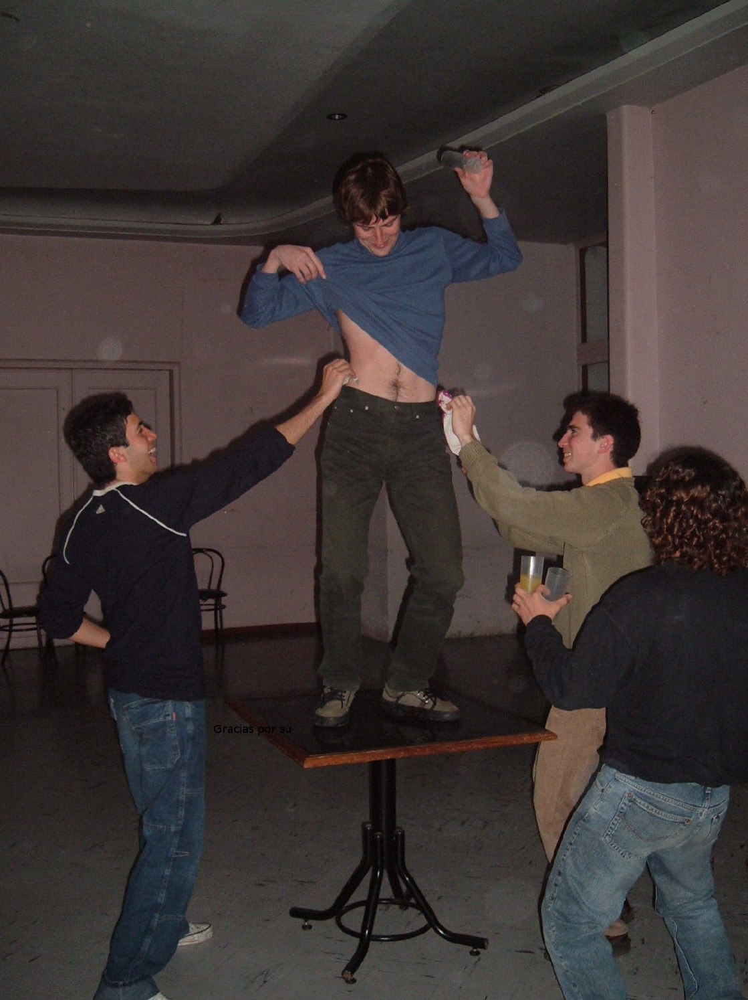
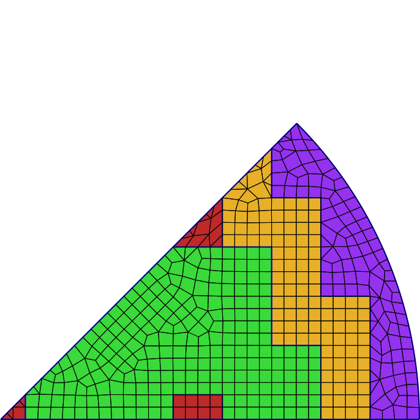
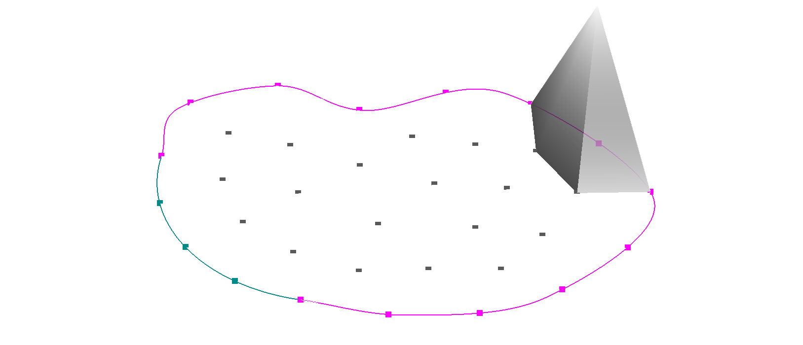
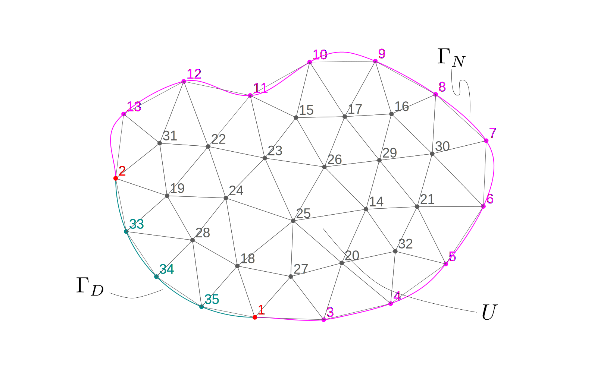

---
title: Transporte de neutrones en la nube
subtitle: Tesis de Doctorado en Ingeniería Nuclear
author: Mg. Ing. Germán Theler
institute: Instituto Balseiro
aspectratio: 169
lang: es-AR
theme: default
innertheme: rectangles
fonttheme: professionalfonts
outertheme: number
colorlinks: true
sansfont: Carlito
monofont: DejaVuSansMono
header-includes:
  - \newcommand{\omegaversor}{\hat{\symbf{\Omega}}}
  - \newcommand{\omegaprimaversor}{\hat{\symbf{\Omega}}^\prime}
  - \renewcommand{\vec}[1]{\mathbf{#1}}
  - \newcommand{\mat}[1]{\mathsf{#1}}
  - \renewcommand\spanishtablename{Tabla}
  - \input{syntax-feenox.tex}
  - \input{syntax.tex}
...


## 

\centering 

## 

\centering
{height=5.75cm}
{height=5.75cm}

## 

\centering 


## 

\centering 

## 

\centering 

## 

\centering 

## 

\centering 


## 

\centering 

## 

```{=latex}
\begin{center}
\small{A cloud-first approach for solving core-level neutron transport over unstructured grids}
\end{center}
```

\medskip

. . .


$$
\underbrace{\text{Transporte de neutrones}}_\text{física de reactores}
\underbrace{\text{en la nube}}_\text{programación}
$$

. . .

\medskip


:::::::::::::: {.columns}
::: {.column width="22%"}
:::

::: {.column width="46%"}

\vspace{0.6cm}

 1. Introducción

\vspace{1.05cm}

 2. Transporte y difusión de neutrones
 3. Esquemas de discretización numérica

\vspace{0.95cm}

 4. Implementación computacional
 5. Resultados

:::

::: {.column width="10%"}

$$
\left.
\begin{matrix} ~ \end{matrix}
\right\} \text{Why}
$$

$$
\left.
\begin{matrix} ~ \\ ~ \end{matrix}
\right\} \text{How}
$$


$$
\left.
\begin{matrix} ~ \\ ~ \end{matrix}
\right\} \text{What}
$$

:::

::: {.column width="22%"}
:::

::::::::::::::


## 

\centering 


## Cien años de programación


 Computer | Monthly Rental  | Relative Speed | First Delivery 
:----------------|:------------------------:|:-----------:|:-----------:
 CDC 3800        |         $ 50,000         |     1       |  Jan 66
 CDC 6600        |         $ 80,000         |     6       |  Sep 64
 CDC 6800        |         $ 85,000         |     20      |  Jul 67
 GE 635          |         $ 55,000         |     1       |  Nov 64
 IBM 360/62      |         $ 58,000         |     1       |  Nov 65
 IBM 360/70      |         $ 80,000         |     2       |  Nov 65
 IBM 360/92      |         $ 142,000        |     20      |  Nov 66
 PHILCO 213      |         $ 78,000         |     2       |  Sep 65
 UNIVAC 1108     |         $ 45,000         |     2       |  Aug 65

: "Recent developments in computers and their implication for reactor calculations" (1965)^[1 USD @ 1965 $\approx$ 10 USD @ 2023]

## Historia de dos reactores


## Esquema de dos pasos


## Esquema acoplado con cinética espacial


En los dos casos hay que meter boro en neutrónica

## Los canales de los PHWR

:::::::::::::: {.columns}
::: {.column width="45%"}


\centering Atucha

:::

::: {.column width="10%"}
:::

::: {.column width="45%"}


\centering CANDU

:::
::::::::::::::


## 

:::::::::::::: {.columns}
::: {.column width="45%"}

:::

::: {.column width="10%"}
. . . 
:::

::: {.column width="45%"}

:::
::::::::::::::

. . . 

:::::::::::::: {.columns}
::: {.column width="45%"}

:::

::: {.column width="10%"}
. . . 
:::

::: {.column width="45%"}

:::
::::::::::::::


## Celdas...

:::::::::::::: {.columns}
::: {.column width="50%"}


\centering de representación
:::

::: {.column width="50%"}


\centering de cálculo
:::
::::::::::::::


## 

\centering 

## 

\centering 


## 

\centering 

## 

:::::::::::::: {.columns}
::: {.column width="50%"}

\centering 

\centering +

\centering {width=60%}

:::

. . .

::: {.column width="50%"}

\centering 

:::
::::::::::::::

## 

:::::::::::::: {.columns}
::: {.column width="50%"}


:::

. . .

::: {.column width="50%"}


:::
::::::::::::::


## 


. . . 


\centering ¿Vale usar difusión?

 
## Limitaciones


 i. dilución de XS por mismatch de mallas CFD/neutrónica
 
 ii. efecto staircase al modelar canales circulares
 
 iii. cuestionable validez de difusión
 
\bigskip 
 
. . .

### La propuesta de esta tesis


$$
\text{difusión} \rightarrow \text{muy simplificado} \Rightarrow S_N \rightarrow \text{escala muy rápido} \Rightarrow \text{esquema}
\begin{cases}
 \text{paralelizable} \\
 \text{flexible} \\
 \text{extensible}
\end{cases}
$$


## IAEA 3D PWR Benchmark

:::::::::::::: {.columns}
::: {.column width="50%"}

:::

::: {.column width="50%"}

:::
::::::::::::::

## 

:::::::::::::: {.columns}
::: {.column width="56%"}

:::

::: {.column width="44%"}
\vspace{0.6cm}

:::
::::::::::::::


## 

:::::::::::::: {.columns}
::: {.column width="56%"}

:::

::: {.column width="44%"}
\vspace{0.6cm}

:::
::::::::::::::


## 

:::::::::::::: {.columns}
::: {.column width="56%"}

:::

::: {.column width="44%"}
\vspace{0.6cm}

:::
::::::::::::::

## IAEA 3D PWR Benchmark con 1/8, reflector circular & S$_N$ (2023)

:::::::::::::: {.columns}
::: {.column width="50%"}
\centering {height=8cm}
:::

::: {.column width="50%"}
\centering  {height=8cm}
:::
::::::::::::::


## 

\centering 


## 

:::::::::::::: {.columns}
::: {.column width="20%"}

\vspace{1cm}

\centering 

Lucio Séneca

4 a.C.---65 d.C.
:::

::: {.column width="80%"}

> No debemos tan sólo escribir ni tan sólo leer.
> Hay que acudir a la vez a lo uno y a lo otro, y combinar ambos ejercicios a fin de que, cuantos pensamientos ha recogido la lectura, los reduzca a la unidad.
>
> \medskip
>
> Lo que comprobamos que realiza en nuestro cuerpo la naturaleza sin ninguna colaboración nuestra, es eso lo que tenemos que hacer con la lectura. Los alimentos que tomamos, mientras mantienen su propia cualidad y compactos flotan en el estómago, son una carga.
> Mas cuando se ha producido su trasformación, entonces y sólo entonces, se convierten en fuerza y sangre.
> Procuremos otro tanto con los alimentos que nutren nuestro espíritu.
> No permitamos que queden intactos cuántos hayamos ingerido para que no resulten ajenos a nosotros.
> Asimilémoslos. De otra suerte, irán al acervo de la memoria y no al de la inteligencia.
>
> \medskip
>
> ¿Cómo lograr esto te preguntas? Con una constante aplicación.
>
>

:::
::::::::::::::

## 2. Transporte y difusión de neutrones

:::::::::::::: {.columns}
::: {.column width="50%"}

 1. Secciones eficaces
    1. Dispersión de neutrones
    2. Expansión en polinomios de Legendre
    3. Fisión de neutrones
 2. Flujos y ritmos de reacción
 3. Transporte de neutrones
    1. Operador de transporte
    2. Operador de desapariciones
    3. Operador de producciones
    4. La ecuación de transporte
    5. Armónicos esféricos y polinomios de Legendre
    6. Transporte linealmente anisótropo en estado estacionario
    7. Condiciones iniciales y de contorno
    
:::
::: {.column width="50%"}
    
    
 4. Aproximación de difusión
    1. Momento de orden cero
    2. Momento de orden uno
    3. Ley de Fick
    4. La ecuación de difusión
    5. Condiciones de contorno
 5. Esquema de solución multi-escala
    1. Evaluación y procesamiento de secciones eficaces
    2. Cálculo a nivel celda
    3. Cálculo a nivel núcleo
    
. . .

\medskip

\centering 


<https://github.com/gtheler/thesis>

:::
::::::::::::::

## Ecuación de transporte

$$
\begin{gathered}
 \sqrt{\frac{m}{2E}} \frac{\partial}{\partial t} \Big[ \psi(\vec{x}, \omegaversor, E, t) \Big]
 + \omegaversor \cdot \text{grad} \left[ \psi(\vec{x}, \omegaversor, E, t) \right]
 + \Sigma_t(\vec{x}, E) \cdot \psi(\vec{x}, \omegaversor, E, t) = \\
 \int_{0}^{\infty} \int_{4\pi} \Sigma_s(\vec{x}, \omegaprimaversor \rightarrow \omegaversor, E^\prime \rightarrow E) \cdot \psi(\vec{x}, \omegaprimaversor, E^\prime, t) \, d\omegaprimaversor \, dE^\prime \\
+ \frac{\chi(E)}{4\pi} \int_{0}^{\infty} \int_{4\pi} \nu\Sigma_f(\vec{x}, E^\prime) \cdot \psi(\vec{x}, \omegaprimaversor, E^\prime, t) \, d\omegaprimaversor \, dE^\prime 
+ s(\vec{x}, \omegaversor, E, t)
\end{gathered}
$$

## Expansión en armónicos esféricos

\centering {height=8cm}


## Transporte linealmente anisótropo en estado estacionario

$$
\begin{gathered}
 \omegaversor \cdot \text{grad} \left[ \psi(\vec{x}, \omegaversor, E) \right]
 + \Sigma_t(\vec{x}, E) \cdot \psi(\vec{x}, \omegaversor, E) = \\
\frac{1}{4\pi} \cdot 
\int_{0}^{\infty} \Sigma_{s_0}(\vec{x}, E^{\prime} \rightarrow E) \cdot \int_{4\pi} \psi(\vec{x}, \omegaprimaversor, E^{\prime}) \, d\omegaprimaversor \, dE^\prime + \\
\frac{3 \cdot \omegaversor}{4\pi} \cdot
\int_{0}^{\infty} \Sigma_{s_1}(\vec{x}, E^{\prime} \rightarrow E) \cdot \int_{4\pi} \psi(\vec{x}, \omegaprimaversor, E^{\prime}) \cdot \omegaprimaversor \, d\omegaprimaversor \, dE^\prime  \\
+ \frac{\chi(E)}{4\pi} \int_{0}^{\infty} \nu\Sigma_f(\vec{x}, E^\prime) \cdot \phi(\vec{x}, E^\prime) \, dE^\prime 
+ s(\vec{x}, \omegaversor, E)
\end{gathered}
$$


. . .

### Aproximación de difusión

\vspace{-0.7cm}

$$
\begin{gathered}
 - \text{div} \Big[ D(\vec{x}, E) \cdot \text{grad} \left[ \phi(\vec{x}, E) \right] \Big]
 + \Sigma_t(\vec{x}, E) \cdot \phi(\vec{x}, E)
 = \\
\int_{0}^{\infty} \Sigma_{s_0}(\vec{x}, E^{\prime} \rightarrow E)  \cdot \phi(\vec{x}, E^\prime) \, dE^\prime +
\chi(E) \int_{0}^{\infty} \nu\Sigma_f(\vec{x}, E^\prime) \cdot \phi(\vec{x}, E^\prime) \, dE^\prime
+ s_0(\vec{x}, E)
\end{gathered}
$$


## 


:::::::::::::: {.columns}
::: {.column width="25%"}

\vspace{1cm}

\centering 

Paul Graham

1964--
:::

::: {.column width="75%"}

\vspace{1cm}

> You can know a great deal about something without writing about it. Can you ever know so much that you wouldn't learn more from trying to explain what you know? I don't think so. I've written about at least two subjects I know well---Lisp hacking and startups---and in both cases I learned a lot from writing about them.^[Machinery and circuits are formal languages.] In both cases there were things I didn't consciously realize till I had to explain them. And I don't think my experience was anomalous. A great deal of knowledge is unconscious, and experts have if anything a higher proportion of unconscious knowledge than beginners.
>

:::
::::::::::::::


## 3. Esquemas de discretización numérica

### Discretización en energía: multi-grupo

{width=100%}

. . .

### Discretización en ángulo: ordenadas discretas

:::::::::::::: {.columns}
::: {.column width="25%"}

:::
::: {.column width="25%"}

:::
::: {.column width="25%"}

:::
::: {.column width="20%"}

:::
::::::::::::::


## Cuadraturas de nivel simétrico


:::::::::::::: {.columns}
::: {.column width="25%"}
```sn


       1    
```

:::
::: {.column width="25%"}
```sn

       1   
      1 1  
```

:::
::: {.column width="25%"}
```sn 

       1   
      2 2  
     1 2 1 
```
:::
::: {.column width="20%"}
```sn  
       1   
      2 2  
     2 3 2 
    1 2 2 1
```

:::
::::::::::::::

:::::::::::::: {.columns}
::: {.column width="25%"}
```sn    


       1    
      2 2   
     3 4 3  
    2 4 4 2 
   1 2 3 2 1
```
:::
::: {.column width="25%"}
```sn      

       1     
      2 2    
     3 4 3   
    3 5 5 3  
   2 4 5 4 2 
  1 2 3 3 2 1
```
:::
::: {.column width="25%"}
```sn

       1      
      2 2     
     3 5 3    
    4 6 6 4   
   3 6 7 6 3  
  2 5 6 6 5 2 
 1 2 3 4 3 2 1
```
:::
::: {.column width="20%"}

```sn          
       1       
      2 2      
     3 5 3     
    4 6 6 4    
   4 7 8 7 4   
  3 6 8 8 6 3  
 2 5 6 7 6 5 2 
1 2 3 4 4 3 2 1
```
:::
::::::::::::::

## Discretización en espacio: elementos finitos


## Discretización en espacio: elementos finitos


## Discretización en espacio: funciones de forma

:::::::::::::: {.columns}
::: {.column width="50%"}

:::
::: {.column width="50%"}

:::
::::::::::::::

:::::::::::::: {.columns}
::: {.column width="50%"}

:::
::: {.column width="50%"}

:::
::::::::::::::


## Discretización en espacio: elementos finitos




## Extras

### Elementos de segundo orden

:::::::::::::: {.columns}
::: {.column width="50%"}

:::
::: {.column width="50%"}

:::
::::::::::::::


. . . 


### Condiciones de Dirichlet no homogéneas

Justificación de `MatZeroRows()`

<https://scicomp.stackexchange.com/questions/5072/how-to-properly-apply-non-homogeneous-dirichlet-boundary-conditions-with-fem>


 * Segunda respuesta más votada (después de la de Jed Brown)


## 

Contribuciones globales

 * Poisson steady-state
 
 * Core-level neutronics
 
   - with sources
   - without sources

## 


\centering 

## Historia de Unix


## 

\centering 

## 

:::::::::::::: {.columns}
::: {.column width="33%"}
\centering {height=1.5cm}

\centering {height=6.5cm}
:::

. . .

::: {.column width="33%"}
\centering 

\centering {height=2.5cm} {height=2.5cm} {height=2.5cm} {height=2.5cm}

\centering 
:::

. . .

::: {.column width="33%"}

\vspace{2cm}

{height=7cm}
:::
::::::::::::::


## SRS/SDS

 1. Software Requirements Specification
 
. . .
 
 2. Software Design Specification


### 

TOC del SRS

Highlights:

 - FOSS
 - cloud first
   - transfer function
   - Don's quote
 - Scalable
 - Flexible
 - Extensible
 
## Implementación

Arquitectura y otras secciones

Self-descriptive English

Definiciones e instrucciones

src/pdes

Ejemplo de lo que pasa en un input

Apéndices: algebraic parser, funciones, etc.

## 

                                           |    a    |    b    |    c    |    d
:------------------------------------------|:-------:|:-------:|:-------:|:-------:
 6.1. Mapeo en mallas no conformes         |    ●    |    ●    |         |    ○
 6.2. El problema de Reed                  |    ◌    |    ○    |    ●    |
 6.3. Benchmark PWR IAEA                   |    ○    |    ●    |         |    ○
 6.4. El problema de Azmy                  |    ●    |    ●    |    ●    |    ◌
 6.5. Benchmarks de Los Alamos             |    ●    |    ○    |    ●    |
 6.6. Slab a dos zonas                     |    ●    |    ●    |         |
 6.7. Reactor cubo-esfera                  |    ●    |    ●    |         |
 6.8. El problema de los pescaditos        |    ●    |    ●    |    ◌    |
 6.9. MMS con el Stanford bunny            |    ●    |    ●    |    ◌    |    ◌
 6.10. PHWR vertical con barras inclinadas |    ●    |    ●    |    ●    |    ●
 6.11. Cinética puntual                    |         |         |         |

:::::::::::::: {.columns}
::: {.column width="75%"}

 a. Filosofía Unix, integración en scripts y simulación programática
 b. Mallas no estructuradas
 c. Ordenadas discretas (además de difusión)
 d. Paralelización en varios nodos de cálculo con MPI

:::
::: {.column width="25%"}

 ● requerido  
 ○ recomendado  
 ◌ opcional

:::
::::::::::::::


## Conclusiones


## Trabajos futuros

## 

\centering Foto mía dando la charla  


# Apéndices

## JOSS

## Dirichlet BCs

stack overflow

## English vs. Castellano

lista de palabras
to be - ser/estar

El título sería "A cloud-first approach for solving core-level neutron transport over unstructured grids"

núcleo / nuclei / core / kernel

